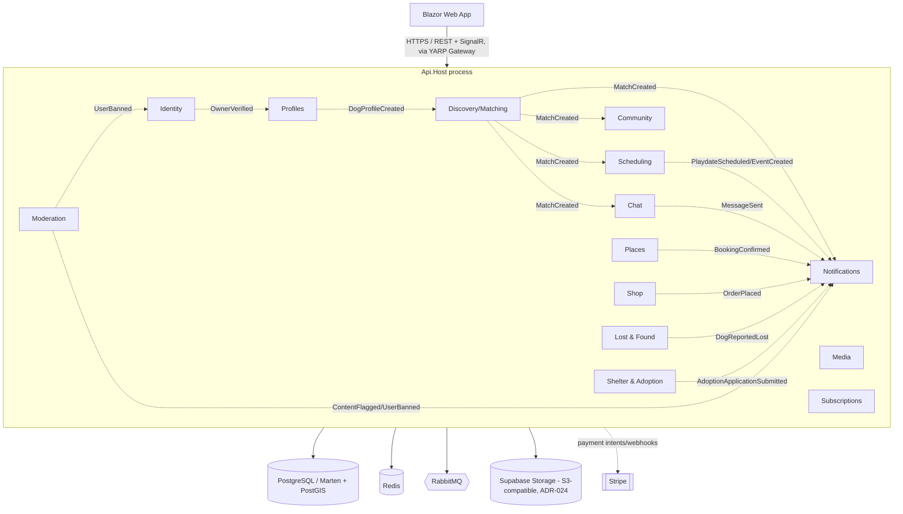
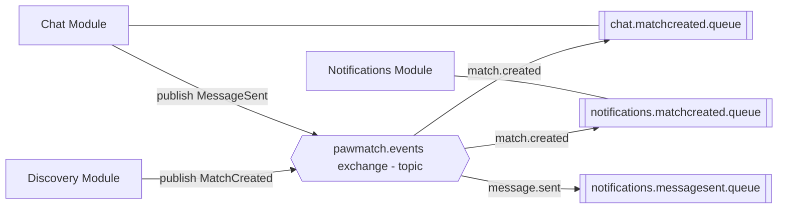
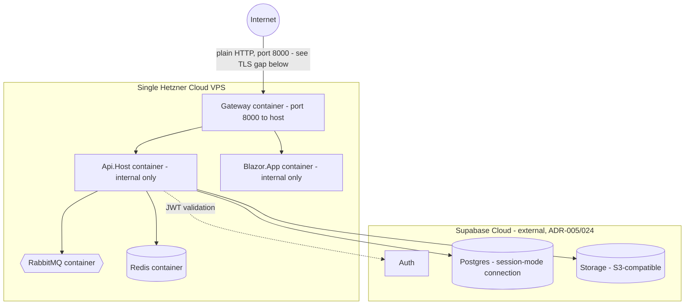
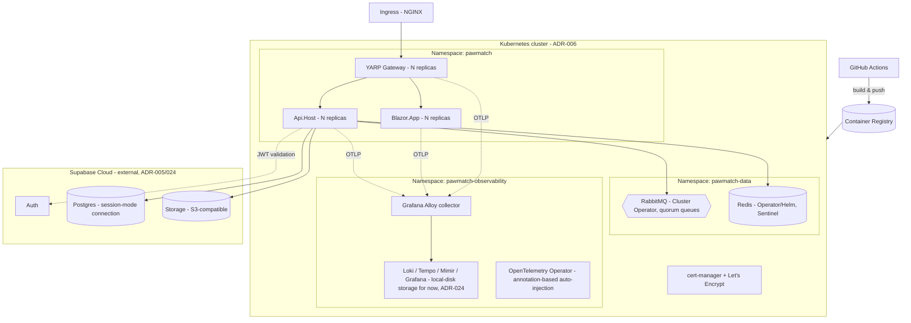

# Solution Architecture Document — PawMatch Platform

## 1. Architectural Style
**Modular Monolith** using **Vertical Slice Architecture** inside each module, deployed as a small number of containers rather than dozens of microservices — while keeping module boundaries strict enough to extract a module into its own service later with minimal rework.

Core principles:
1. **One deployable, many modules.** The `Api.Host` composes all business modules into a single ASP.NET Core process (or a small number of processes — see Section 7 for the split option).
2. **Vertical slices, not horizontal layers.** Each feature (e.g., "Like a Dog", "Send Chat Message") is a self-contained folder with its request, handler, validator, and response — not spread across a `Controllers/`, `Services/`, `Repositories/` layer cake.
3. **Module isolation at compile time.** Modules only reference each other's `Contracts` project (DTOs + integration events). No module references another module's `Domain` or `Infrastructure` project. Enforced via architecture tests in CI.
4. **In-process calls within a module; async events across modules.** A slice in the Discovery module never calls into Chat's domain directly — it publishes an integration event (`MatchCreated`) that Chat subscribes to. **Wolverine** is the single library for both paths: the same handler method signature works whether the message is dispatched in-process or delivered over RabbitMQ, so a slice's business logic doesn't change shape depending on who's calling it.
5. **Marten as both document store and event store**, chosen per module — see the expanded classification table in Section 2.1 now that the module count has grown to 15.
6. **Command validation state is never a shared aggregate bundle (ADR-019).** This is a stricter rule than "event-sourced modules use aggregates" — it governs *what a command handler is allowed to load*. A DDD-style aggregate root that bundles every field an entity could ever have (status, items, payment info, timestamps, everything) is a **query read model wearing a command's clothes**. Each command gets its own minimal state projection, computed live from only the events it actually needs to make its decision, never persisted as a shared snapshot and never reused by a second command handler. See Section 2.2.

## 2. Module Map & Boundaries



Dotted lines = async integration events via RabbitMQ (through the outbox). Solid lines = synchronous infrastructure dependencies. This diagram intentionally omits some lower-traffic event edges (e.g. every module that emits something Moderation might act on) for readability — the full event catalog belongs in each module's README, not this diagram.

### 2.1 CRUD (document) vs. event-sourced classification, all 15 modules

| Module | Marten style | Why |
|---|---|---|
| Identity | Document | Thin projection over Supabase's user lifecycle (ADR-005) - current-state only, plus the ADR-017 role-lookup table |
| Profiles | Document | Current-state dog/owner data |
| Discovery/Matching | **Event-sourced** | Swipe/match history and provenance are first-class data |
| Scheduling | Document, with a lightweight status-history array | Playdate/event lifecycle (proposed → accepted → completed) is meaningful but low-volume enough that a document with an embedded history is simpler than a full stream |
| Community | Document | Feed posts, likes, follows - current-state, high read volume, projections favor plain documents |
| Chat | **Event-sourced** | Full message/read-receipt history is exactly what event sourcing is for |
| Places | Document | Listings + reviews - current-state |
| Shop | **Event-sourced** (order lifecycle) + Document (catalog) | Orders are a natural state machine (Placed → Paid → Shipped → Delivered) worth full history for disputes/support; product catalog itself is plain document CRUD |
| Lost & Found | **Event-sourced** | A report's sighting history accumulates over time and the sequence matters for reunification |
| Shelter & Adoption | Document | Listings + applications - current-state |
| Notifications | Document | Log + preferences - current-state |
| Media | Document | Asset metadata - current-state (the binary itself lives in Supabase Storage, not Marten) |
| Subscriptions | Document | Current-state entitlement |
| Moderation | Document | Reports/cases - current-state, though could move to event-sourced later if audit trail requirements grow |

**Rule of thumb for choosing sync vs async between modules:**
- If module B *needs to react* to something in module A but doesn't need an immediate answer → integration event (async, via RabbitMQ).

### 2.2 Command State vs. Query Read Models (ADR-019)

Two different things have been getting conflated as "the aggregate," and they need to stay separate:

| | Command State | Query Read Model |
|---|---|---|
| Purpose | Validate one specific command's preconditions | Serve UI/processor queries |
| Shape | Minimal — only the fields that command's decision needs | Rich — whatever the screen needs |
| Ownership | Exactly one command handler | Shared by whoever queries it |
| Persistence | **Never persisted** — computed live from the stream per invocation (`session.Events.AggregateStreamAsync<TState>(streamId)`) | Persisted Marten document/projection, kept current by a state-view slice's projector |
| Naming | `[CommandName]State` (implemented) or `[CommandName]StateToDo` (planned, not yet built) | Named after what it displays (`DiscoveryFeedItem`, `ConversationTranscript`) |

**The state-view lane from ADR-008 (`EVENT(s) → READMODEL → SCREEN`) is entirely about the right-hand column above and is unaffected by this rule.** What changes is the *left* side — the state a command handler loads to decide whether to accept or reject, which was previously modeled the same way as a query read model (a persisted Marten snapshot) and shouldn't be.

**Concrete correction applied to the scaffold:** `MatchAggregate` (as originally built) bundled `DogAId`, `DogBId`, `DogALiked`, `DogBLiked`, `IsMatched`, `MatchedAt`, and `Version` into one Marten inline-snapshot type, and `DetectMutualMatchHandler` loaded the whole thing — a DDD-aggregate-shaped bundle doing command-state duty. This has been corrected:
- `MatchAggregate` (the persisted snapshot) is removed.
- `DetectMutualMatchState` replaces it — the minimal fields `DetectMutualMatch` actually needs to decide "did this complete a mutual match" — built live via `AggregateStreamAsync<DetectMutualMatchState>`, never stored.
- The deterministic pair-stream ID helper (`StreamIdFor`) moves to a small stream-identity helper (`MatchStream`) that isn't itself a state bundle — computing a stream ID is not the same concern as projecting state from that stream.
- If a future query screen genuinely needs a rich "match status" view (e.g. showing both dogs' like status to a moderator), that's a new, separately-named, separately-projected Query Read Model — never a reuse of `DetectMutualMatchState`.

This same discipline applies going forward to every event-sourced module (Chat, Shop's order lifecycle, Lost & Found): when a new command needs to validate against stream history, it gets its own `[CommandName]State`, computed live, not a shared aggregate.
- If module B *needs data owned by* module A to render a response right now → either (a) module B keeps its own read-model copy updated via events (preferred, avoids runtime coupling), or (b) a narrow, versioned internal HTTP call to A's public API (used sparingly, e.g., Media serving a signed URL).

## 3. Module Internal Structure (Vertical Slice)

> **Superseded in detail by `docs/05-event-modeling-blueprint.md` (ADR-008).** The folder convention below is the current one: `Commands/`, `ReadModels/`, and `Automations/` replace the original flat `Features/` folder, and each slice is constrained to exactly one of state-change, state-view, or automation. What follows is kept for the general shape; see the blueprint doc for the authoritative rule and the worked example of splitting a command that had accidentally absorbed automation logic.

Example: `Modules/Discovery`

```
PawMatch.Modules.Discovery.Api/
├── Features/
│   ├── SwipeOnDog/
│   │   ├── SwipeOnDog.cs               (command record)
│   │   ├── SwipeOnDogHandler.cs        (static Handle method: [WolverinePost] route + validation + logic + returns response & MatchCreated event, in one place)
│   │   └── SwipeOnDogValidator.cs
│   ├── GetDiscoveryFeed/
│   │   ├── GetDiscoveryFeed.cs         (query record)
│   │   └── GetDiscoveryFeedHandler.cs  ([WolverineGet] route + query logic)
│   └── UndoLastSwipe/
│       └── ...
├── IntegrationEvents/
│   ├── Consumers/
│   │   └── DogProfileCreatedConsumer.cs
│   └── Published/
│       └── MatchCreated.cs
├── Module.cs                          (IModuleInstaller: DI registration, endpoint mapping)
└── DiscoveryModuleDbConfig.cs         (Marten schema/index config for this module)

PawMatch.Modules.Discovery.Domain/
├── Aggregates/
│   └── SwipeSession.cs / MatchAggregate.cs
├── Events/
│   ├── DogLiked.cs
│   ├── DogPassed.cs
│   └── MatchFormed.cs
└── ValueObjects/
    └── GeoCoordinate.cs

PawMatch.Modules.Discovery.Infrastructure/
├── MartenDiscoveryStore.cs
└── ExternalGeoServiceClient.cs

PawMatch.Modules.Discovery.Contracts/
└── (public DTOs + integration events other modules may reference)
```

Each module exposes a single `Module.cs` implementing a shared `IModuleInstaller` interface. `Api.Host`'s `Program.cs` discovers and wires these at startup — this is the only place that "knows about" every module.

## 4. Data Architecture

- **All reads and writes go to the Postgres primary (ADR-021)** — no replica read-routing. Supabase's managed Postgres (ADR-024) offers its own read replicas on paid tiers for HA/scale, not that this project is using them; every Marten session in this codebase, command or query, talks to primary by default and nothing should override that without a deliberate, documented exception.
- **Marten's connection targets Supabase's session-mode/direct Postgres connection string, not the default transaction-mode pooled one (ADR-024).** The async daemon's advisory-lock-based leader election needs session-level connection behavior that transaction-mode pooling doesn't reliably provide.
- **Row Level Security is not enabled on Marten's tables (ADR-026).** Api.Host is the sole gatekeeper to this data — authorization happens in C#, not in Postgres policies. RLS protects a direct-client-to-Postgres pattern this app doesn't use; enabling it without a matching policy on every Marten-created table risks a silent deny-all lockout depending on which Postgres role the connection string uses. Supabase Storage is the exception — its access control is genuinely RLS-based and that's the right place to use it.
- **Single Postgres cluster, one Marten `DocumentStore` per module** (or one store with per-module schema via Marten's multi-tenancy-by-schema feature) — keeps module data physically isolated even inside one database, so a future split to separate databases is a config change, not a data migration.
- **Document-centric modules** (Identity, Profiles, Subscriptions, Moderation): Marten used as a document DB — `session.Store<DogProfile>()`, projections built with `Include()`/compiled queries as needed.
- **Event-sourced modules** (Discovery/Matching, Chat): Marten event store — aggregates like `MatchAggregate` and `ConversationAggregate` are event streams (`DogLiked`, `DogPassed`, `MatchFormed`, `MessageSent`, `MessageRead`); async daemon projections build read models (e.g., `MatchSummary`, `ConversationTranscript` flat documents) for fast querying. This is deliberate for both modules: match history and full message/read-receipt history are exactly the kind of "what happened, in what order, and can we prove it" data event sourcing is built for — versus Identity/Profiles/Subscriptions/Media/Moderation, which are current-state-oriented and stay as plain Marten documents.
- **Outbox pattern**: domain events that need to leave the module are written to an outbox document/table in the *same* Marten session/transaction as the domain change, then a background dispatcher publishes them to RabbitMQ and marks them sent — guarantees no event is lost if the process crashes between DB commit and publish.
- **Geo queries**: dog owner location stored as lat/long; discovery feed queries use PostGIS (`geography` type) via Marten's raw SQL/linq extension support, or Marten's built-in spatial querying if sufficient for MVP radius search.

## 5. Messaging Architecture (RabbitMQ)



- **Topic exchange** (`pawmatch.events`) with routing keys like `match.created`, `message.sent`, `content.flagged`. Wolverine's RabbitMQ transport maps this via `PublishMessage<T>().ToRabbitExchange("pawmatch.events")` conventions, configured once in `Api.Host` composition.
- Each consumer module owns its own durable queue bound to the events it cares about — publishers never know who's listening (loose coupling). A module's Wolverine handler for an integration event looks identical to a handler for a local command (`public static Task Handle(MatchCreated evt, ...)`), so there's no special "consumer" ceremony to learn.
- **Dead-letter queues** per consumer queue for poison messages; alerting on DLQ depth. Wolverine's built-in retry/error-handling policies (`OnException<T>().RetryWithCooldown(...)`, then move-to-dead-letter) cover this without extra infrastructure code.
- **Durable inbox/outbox via `WolverineFx.Marten`**: outgoing messages are written to Wolverine's envelope tables in the *same* Postgres transaction as the Marten session that recorded the domain change (no separate outbox document to maintain by hand, as would be needed with a bare messaging library), and incoming messages are deduplicated by envelope ID automatically — Wolverine handles the idempotency, so handlers don't need to.
- Message contracts versioned (`MatchCreatedV1`) and live in each module's `Contracts` project — the only cross-module compile-time dependency allowed.

## 6. Caching Architecture (Redis)

| Use case | Pattern |
|---|---|
| Discovery feed caching | Cache-aside, short TTL (30–60s) per user, invalidated on new swipe |
| Session/auth token cache | `IDistributedCache` for token introspection results |
| SignalR backplane | `AddStackExchangeRedis()` for Chat hub scale-out across replicas |
| Rate limiting | Redis-backed sliding window (e.g., via `Microsoft.AspNetCore.RateLimiting` + custom Redis store) for swipe/report endpoints |
| Output caching | ASP.NET Core Output Cache with Redis store for read-heavy, low-personalization endpoints (e.g., public profile view) |

## 7. Deployment Architecture

Two deployment targets exist in this document now, deliberately not one: **7.1 is the current MVP target (ADR-025)** — what's actually running. **7.2 is the later-scale target (ADR-006)** — Kubernetes, not yet built, still the plan for when Hetzner-single-box stops being enough. Don't read the Kubernetes diagram as "what we're deploying now" — that's the mistake this restructure is meant to prevent.

### 7.1 MVP Deployment (current target — ADR-025)



- **One box, five containers**: `docker-compose.prod.yml` runs `gateway`, `api-host`, `blazor-app`, `rabbitmq`, `redis` on a single Hetzner Cloud VPS. Only `gateway` is exposed to the host (port 8000); `api-host`/`blazor-app` are reached through it over the internal Docker network, matching the Gateway's existing routing config.
- **Sizing**: not load-tested, but a reasonable starting point for early MVP traffic is a Hetzner **CX32** (4 vCPU / 8GB) or **CX42** (8 vCPU / 16GB) — five containers including two message-broker/cache processes will want headroom beyond the smallest instance types. Resize once you have real traffic data rather than guessing further.
- **No TLS in the current compose file** — `gateway` serves plain HTTP on port 8000. This is a real gap for anything beyond "test that it's reachable," not a nice-to-have: browsers will warn, and credentials/tokens would travel unencrypted. The straightforward fix is adding **Caddy** in front (or as a replacement ingress point) for automatic Let's Encrypt certificates given a domain name pointed at the box — one more container, minimal config, no manual cert renewal. Not built yet; flagged rather than shipped-and-forgotten.
- **No backup story for the self-hosted RabbitMQ/Redis Docker volumes.** Postgres and Storage are Supabase's problem now (ADR-024) — RabbitMQ and Redis are not. On a single box, "the disk dies" means that data is gone. RabbitMQ's data is largely transient (in-flight messages, not a system of record) so this is lower-stakes than it sounds, but worth a conscious decision rather than an accidental one — at minimum, Hetzner's own volume snapshot feature is a cheap first step.
- **CD mechanism needs revisiting, not just retargeting.** ADR-013 (push-based CD) assumed GitHub Actions running `helm upgrade` against a Kubernetes cluster. That doesn't apply here — the MVP equivalent is something like GitHub Actions building images, pushing to a registry, then SSHing into the Hetzner box to `docker compose pull && docker compose up -d`. Not built yet; the images can be built and run manually (`docker compose ... up -d --build`) until this exists.
- **Single point of failure, accepted deliberately for this stage.** One box means one place for the app, RabbitMQ, and Redis to all go down together. That's the actual trade being made by choosing Hetzner+Compose over Kubernetes for MVP — cheaper and simpler now, in exchange for exactly the kind of resilience ADR-006's operator ecosystem would have provided. Worth revisiting once uptime actually matters to the business, not as a reaction to an outage.

### 7.2 Later-Scale Deployment (Kubernetes — ADR-006, not yet built)



- **Three deployable images**: `PawMatch.Gateway` (YARP, public entry point), `Api.Host` (all backend modules in one process), and `Blazor.App` (frontend). The gateway is the only one exposed by the ingress; `Api.Host` and `Blazor.App` are internal-only ClusterIP services it routes to.
- **Data tier is partly self-hosted in-cluster, partly Supabase-managed (ADR-011/024)** — the operators remaining in-cluster are still the reason Kubernetes was chosen over Azure Container Apps (ADR-006), though that justification is lighter than it was:
  - **Postgres**: no longer in this cluster. Supabase-managed (ADR-024) — connect via its session-mode connection string, not the default transaction-mode pooled one (Marten's advisory-lock-based leader election needs session-level behavior). Backups are Supabase's responsibility, not ours.
  - **RabbitMQ**: official RabbitMQ Cluster Operator, quorum queues for durability across pod restarts/rescheduling.
  - **Redis**: Operator (or Bitnami Helm chart) running primary/replica with Sentinel for failover; SignalR backplane and cache traffic both tolerate a brief failover window, so full active-active isn't needed for MVP.
  - **Storage**: no longer MinIO/no longer in this cluster. Supabase Storage (ADR-024) — S3-compatible, accessed the same way `AWSSDK.S3` always would be, just pointed at Supabase's endpoint. The Grafana LGTM stack (below) does **not** use this as its backing store; see ADR-024's flagged risk on that.
- Horizontal scaling: the three application deployables are stateless (session state in Redis, SignalR backplane in Redis), so replicas scale independently behind the gateway. The data tier scales/fails over via its respective operator, not manually.
- Config via environment variables / mounted secrets (12-factor); no config baked into images.
- Health checks (`/healthz/live`, `/healthz/ready`) per deployable, checking Postgres, Redis, RabbitMQ connectivity for readiness.
- **TLS**: cert-manager + Let's Encrypt issues and rotates certificates for the ingress automatically — no manual cert handling.
- **CD (ADR-013)**: GitHub Actions authenticates to the cluster directly (via cloud OIDC federation where the cluster is cloud-hosted, otherwise a scoped kubeconfig held as a GitHub encrypted secret) and runs `helm upgrade`/`kubectl apply` after each build — no GitOps controller in the loop. This is simpler to reason about with a small team, at the cost of no automatic drift detection between what's in Git and what's actually running; worth revisiting if the cluster ever gets manual `kubectl` changes applied outside the pipeline. Note this deploy credential is a CI bootstrap secret held in GitHub itself, not synced via ESO/Vault — ESO's scope is secrets *inside* the cluster for the running application, not CI's own access to reach the cluster in the first place.

### 7.3 Future split option
Because modules only communicate via events/contracts, a module suspected of needing independent scaling (e.g., Chat, under real-time load) can be pulled into its own container image later — same code, just a different `Program.cs` composition root that hosts only that module. This is the primary payoff of the modular-monolith-first approach. Applies whichever deployment target is current — it's a code-structure benefit, not specific to Kubernetes.

### 7.4 Operational cost of self-hosting what's left (ADR-011) — read this before Phase 1
As of ADR-024, self-hosted responsibility is down to RabbitMQ and Redis (plus the Grafana LGTM stack, which is more a monitoring workload than a data-durability one) — Postgres and object storage moved to Supabase's managed SLA, and Auth already was. That's a real reduction from the original six-system ops burden, not just a relabeling: patching, upgrade, and backup-verification responsibility for the two highest-stakes stateful systems (the primary database, and everything users upload) now sits with Supabase rather than this team. What's left (RabbitMQ, Redis) is still real work — quorum-queue operational knowledge, Redis failover testing — and should stay an explicit line item in the Project Plan's Phase 1 estimate, just a smaller one than originally scoped.

## 8. Security Architecture
- **AuthN**: JWT bearer tokens issued by Identity module (or external IdP). Blazor uses `AuthenticationStateProvider` backed by the token.
- **AuthZ**: Policy-based (`[Authorize(Policy = "VerifiedOwner")]`) at the endpoint level per slice. **Role model expanded (ADR-017)**: `Api.Host` now resolves Owner/Vendor/Shelter/Admin roles via its own Postgres lookup keyed by the Supabase JWT's `sub` claim, not just a single authenticated-user shape - Shop and Places endpoints that manage a listing require `Vendor`, Shelter & Adoption's org-side endpoints require `Shelter`, and existing dating/social endpoints stay on the original `VerifiedOwner` policy unchanged.
- **Transport**: TLS everywhere (ingress terminates TLS via cert-manager; optionally mTLS between ingress and pods).
- **Secrets**: never in source/images. **External Secrets Operator (ESO)** syncs secrets from a self-hosted **HashiCorp Vault** into native K8s Secrets — consistent with ADR-011's self-hosting direction rather than a cloud secrets manager. Application deployables only ever see the resulting K8s Secret; nothing in-cluster talks to Vault directly except ESO itself, which keeps the Vault token/AppRole credential blast radius to one component.
- **Payments (ADR-015)**: Stripe Checkout/Elements only - card data never touches PawMatch's servers, keeping PCI scope to SAQ-A. Webhook signatures verified before processing; webhook handlers are idempotent (Wolverine inbox) since Stripe retries on any non-2xx response.
- **Media**: signed, time-limited URLs for photo/video access; upload validated (file type/size) before persisting.
- **Rate limiting & abuse prevention**: per-user swipe-rate limits, report-abuse throttling, CAPTCHA on registration.
- **Data privacy**: location data stored at reduced precision for discovery display; full precision only used server-side for distance calculation.

## 9. Observability (ADR-010: Grafana LGTM + Alloy, zero-code instrumentation)
- **Zero-code instrumentation, Kubernetes-native path**: now that ADR-006 has settled on Kubernetes, the **OpenTelemetry Operator**'s annotation-based auto-injection (`instrumentation.opentelemetry.io/inject-dotnet: "true"` on the pod spec) replaces baking the auto-instrumentation agent into each Dockerfile — genuinely zero code *and* zero Dockerfile changes, centrally upgradable by bumping the `Instrumentation` custom resource rather than rebuilding every image. The Dockerfile/env-var mechanics in the Inventory doc's Section 7 remain the documented fallback for local `docker-compose` (which has no operator to do the injection), so local dev and cluster deployments use the same OTel SDK, just different injection mechanisms.
- **Collector**: Grafana **Alloy** receives OTLP (traces, metrics, logs) from every deployable and routes it to the LGTM components. Locally, the single `grafana/otel-lgtm` container stands in for Alloy + the whole backend, so a developer gets working dashboards with zero setup; production runs Alloy and the LGTM components as separately-scaled workloads.
- **Storage/query backends**: **L**oki (logs), **T**empo (traces), **M**imir (metrics, Prometheus-compatible), unified in **G**rafana with trace-to-logs and trace-to-metrics correlation via exemplars — so a slow request in a dashboard can be clicked through to its trace and the logs emitted during that trace.
- **Correlation across the async boundary**: Wolverine propagates W3C trace context through message envelope headers (both local dispatch and RabbitMQ), so a trace started by `SwipeOnDog`'s HTTP request continues through the `DetectMutualMatch` automation and into whatever `MatchCreatedV1` triggers downstream — the whole "swipe → match → notify" flow shows up as one trace in Tempo, not three disconnected ones.
- **Manual spans where they add value**: business-meaningful spans (e.g. wrapping the mutual-match decision) use the plain `System.Diagnostics.ActivitySource` API, registered via `OTEL_DOTNET_AUTO_TRACES_ADDITIONAL_SOURCES` so they merge into the same trace the auto-instrumentation is already building.
- **Dashboards & alerts**: SLO-based alerting (P95 latency, RabbitMQ queue depth, DLQ growth) built in Grafana against Mimir; log-based alerts against Loki for error-rate spikes. Postgres connection saturation is now visible via Supabase's own dashboard rather than our Prometheus scraping, since it's no longer in-cluster (ADR-024) - worth linking from our Grafana dashboards rather than duplicating. The remaining self-hosted data-tier operators (RabbitMQ Cluster Operator, Redis Operator) still expose Prometheus metrics and should be watched the same as any other in-cluster workload.

## 10. Key Architecture Decisions (ADR summary — full ADRs in `docs/adr/`)

| ADR | Decision | Status |
|---|---|---|
| ADR-001 | Modular monolith over microservices for MVP | Proposed |
| ADR-002 | Mediator/messaging library: Wolverine (with `WolverineFx.Marten` outbox/inbox) | **Decided** |
| ADR-003 | Marten multi-schema-per-module vs multi-database-per-module | Proposed: schema-per-module |
| ADR-004 | Blazor render mode: Server vs WASM vs Auto | Proposed: Auto (per-component) |
| ADR-005 | Identity: **Supabase Cloud (Auth)**, superseding the earlier Keycloak decision. Identity module remains a thin projection over the IdP's user lifecycle, not a credential store — that part of the original rationale is unchanged, only which IdP applies. Supabase chosen for covering more ground than pure auth (also offers Postgres, Storage, Realtime) though this project only adopts its Auth piece for now — see ADR-023 for why the rest isn't adopted alongside it. | **Decided (superseded ADR-005 original)** |
| ADR-006 | Container platform: **Kubernetes**, decided — originally justified partly by the CloudNativePG and MinIO Operators; both are superseded by ADR-024 (Postgres/Storage now Supabase-managed), so the remaining justification is the RabbitMQ Cluster Operator, Redis Operator, OpenTelemetry Operator, and cert-manager. Still enough to justify K8s over Azure Container Apps, but worth being honest that the original rationale weakened rather than pretending nothing changed. | **Decided** |
| ADR-007 | Gateway: YARP (.NET-native reverse proxy) in front of Api.Host + Blazor.App, rather than Kong | **Decided** |
| ADR-008 | Vertical slices are further constrained to exactly one of state-change/state-view/automation (Event Modeling discipline) — see `docs/05-event-modeling-blueprint.md` | **Decided** |
| ADR-009 | ~~Object storage: MinIO (self-hosted, S3-compatible)~~ **Superseded by ADR-024**: object storage is now Supabase Storage (managed, S3-compatible). Kept for history — the original single-node-durability caveat is exactly the kind of ops risk this reversal avoids. | **Superseded (see ADR-024)** |
| ADR-010 | Observability: Grafana LGTM (Loki/Grafana/Tempo/Mimir) fed by Grafana Alloy, with zero-code OpenTelemetry .NET auto-instrumentation (no SDK code in `Program.cs`) | **Decided** |
| ADR-011 | Data tier: **RabbitMQ (RabbitMQ Cluster Operator) and Redis (Redis Operator/Helm) remain self-hosted in-cluster.** Postgres is superseded by ADR-024 (now Supabase-managed) — no longer self-hosted via CloudNativePG, no longer needs a PITR-to-MinIO backup target since Supabase handles Postgres backups on its own managed side. | **Decided (Postgres portion superseded — see ADR-024)** |
| ADR-012 | Secrets: External Secrets Operator syncing from a self-hosted HashiCorp Vault into K8s Secrets, rather than a cloud secrets manager | **Decided** |
| ADR-013 | CD strategy: push-based — GitHub Actions runs `helm upgrade`/`kubectl apply` directly against the cluster after building images — rather than GitOps (ArgoCD/Flux watching a manifests repo) | **Decided** |
| ADR-014 | PostGIS enabled from Phase 1 (not deferred) - Places, Lost & Found, and Discovery all need real proximity queries at once rather than the earlier bounding-box/Haversine placeholder | **Decided** |
| ADR-015 | Payments: Stripe Checkout/Elements for Shop and Subscriptions - PawMatch never stores raw card data; webhook-driven confirmation consumed idempotently via Wolverine's inbox | **Decided** |
| ADR-016 | Video: async FFmpeg-based transcoding worker triggered off `MediaUploaded`, storing outputs back to Supabase Storage (superseding the original MinIO target per ADR-024) - no managed transcoding service for Train C, revisit if volume grows | **Decided** |
| ADR-017 | Identity roles: **role dimension (Owner / Vendor / Shelter / Admin) is looked up from our own Postgres, not carried as a Supabase custom claim.** Originally scoped as "Keycloak realm gains a role dimension" - Keycloak's realm-role model doesn't exist in Supabase. Supabase's equivalent (a Custom Access Token Hook injecting claims from Supabase's *own* managed Postgres) would mean the source of truth for roles lives in Supabase's database, requiring role data to be duplicated/synced there. Instead, `Api.Host` resolves the caller's role via a lookup against our own self-hosted Postgres (ADR-011), keyed by the `sub` claim from the validated Supabase JWT - single source of truth stays in our own data, at the cost of one extra lookup per authorization check (cacheable in Redis if it becomes a hot path). Revisit if this becomes a real bottleneck. | **Decided** |
| ADR-023 | ~~Supabase adoption is scoped to Auth only~~ **Superseded by ADR-024** one turn later — Postgres and Storage moved to Supabase too, so the "Auth only" framing no longer holds. Kept for history since the reasoning (avoid one convenient managed service quietly absorbing decisions made deliberately elsewhere) is still worth reading even though the conclusion changed. | **Superseded (see ADR-024)** |
| ADR-024 | **Supabase scope expanded to Auth + Postgres + Storage**, replacing self-hosted CloudNativePG Postgres (ADR-011) and self-hosted MinIO (ADR-009) entirely. This actually resolves ADR-023's "two separate Postgres instances" tension rather than deepening it — there's now one Postgres (Supabase's), not two. RabbitMQ and Redis are unaffected and remain self-hosted per ADR-011. Two things this creates that need explicit attention, not just a config change: <br>**(1) Connection pooling mode matters for Marten.** Marten's async daemon uses Postgres advisory locks for projection/subscription leader election. Supabase's default pooler (Supavisor) can run in transaction mode, which doesn't reliably support session-level features like advisory locks. Use Supabase's session-mode/direct connection string for the app's Postgres connection, not the default transaction-mode pooled one — get this wrong and the failure is subtle (leader election misbehaving silently) rather than an obvious startup error. <br>**(2) The Grafana LGTM stack (ADR-010) loses its MinIO backing store.** Loki/Tempo/Mimir were architected to reuse the self-hosted MinIO instance for their own object storage. Supabase Storage's S3 compatibility is confirmed for general use, but hasn't been verified against Loki/Tempo/Mimir's specific requirements (more demanding than typical file storage - prefix listing patterns, write consistency). **Default here: run LGTM components with local-disk storage for now, deferring the object-storage decision** rather than forcing an immediate Supabase-Storage-vs-keep-a-small-MinIO-just-for-this choice - revisit once retention/durability requirements are clearer. Flagged, not silently decided; override if you'd rather resolve it now. | **Decided** |
| ADR-025 | **MVP hosting: a single Hetzner Cloud VPS running `docker-compose.prod.yml` directly** (gateway, api-host, blazor-app, rabbitmq, redis) — not the Kubernetes/Helm/operator setup from ADR-006/011. This does **not** reverse ADR-006; Kubernetes remains the target once scale, HA, or team size actually justifies the operational complexity. Hetzner+Compose is explicitly the MVP-stage choice: cheapest path to a real public deployment, single point of failure accepted deliberately for this stage. Consequences that need follow-up, not yet resolved (see Section 7.3): no TLS termination in the current compose file (plain HTTP only), no automated backup of the self-hosted RabbitMQ/Redis Docker volumes (single-box - if the disk dies, that data is gone, unlike Postgres/Storage which are Supabase's problem now per ADR-024), and ADR-013's push-based CD assumed `helm upgrade` against a cluster, not SSH/`docker compose` against a single box - the CD mechanism itself needs revisiting, not just retargeting. | **Decided** |
| ADR-026 | **Do not enable Row Level Security on Marten's tables in the Supabase Postgres database.** RLS protects a pattern this app doesn't use — Supabase's RLS model assumes clients talk to Postgres directly (via PostgREST/Supabase SDK) using JWT-scoped roles, with RLS as the sole access-control layer. PawMatch never does this: `Api.Host` is the sole gatekeeper, doing its own authorization in C# (`VerifiedOwner` policy, ADR-017's role lookup, per-handler ownership checks like `SwipeOnDogHandler`'s). If `ConnectionStrings:Postgres` connects as a role that respects RLS (not `postgres`/anything with `BYPASSRLS`) and RLS gets enabled on a table with no matching policy, the default is deny-all — Marten would silently lose the ability to read/write its own auto-created tables, with no workflow in this architecture to write a matching policy every time Marten creates a new one as modules grow. Confirm which role the connection string uses before ever touching this toggle. **Exception, not covered by this ADR:** Supabase Storage's access control is genuinely built on RLS policies against `storage.objects` — that's how bucket permissions work, not optional. When the Media module is built, real RLS policies on Storage (e.g. "only a dog's owner can delete its photos") belong there. This ADR is about the application database only. | **Decided** |
| ADR-018 | Content & newsletter: lightweight CMS + third-party email platform (not custom-built) for training/health tips and the newsletter | **Decided** |
| ADR-019 | Command validation state is per-command, minimal, and computed live from events (`[CommandName]State`) — never a shared, persisted DDD-style aggregate bundle reused across commands. Distinct from query read models (ADR-008's state-view lane), which remain rich and persisted. | **Decided** |
| ADR-020 | Runtime: **.NET 10** (LTS), moved from the originally planned .NET 8. Not a preference — current Marten (9.x) and Wolverine (6.x) dropped net8.0 support entirely and only target net9.0/net10.0. .NET 10 chosen over .NET 9 since it's the LTS release (even-numbered .NET versions are LTS) and .NET 8's own LTS window is what's being moved away from in the first place, so landing on another LTS keeps the support story consistent. | **Decided** |
| ADR-021 | Database reads: **all reads and writes go to the Postgres primary** — no replica read-routing. Originally justified against CloudNativePG's replicas; now applies identically to Supabase's managed Postgres (ADR-024), which offers its own read-replica option on paid tiers that this project isn't using for the same reasons. Deferred, not ruled out permanently: if read load ever justifies it, any replica-routed query must be opt-in per query (state-view slices only, never command state per ADR-019) and explicitly exclude "authoritative reads" — a state-view slice serving the acting user's own just-written data (e.g. re-fetching a profile immediately after creating it) — which must always hit primary regardless of load, to avoid a user seeing their own write appear to have failed due to replication lag. | **Decided** |
| ADR-022 | Reporting: **FastReport** for any future reporting needs (PDF/Excel exports, admin dashboards — e.g. Shop sales reports, Moderation case reports). Not yet needed by any module in the current 15-module scope; recorded now so the choice isn't improvised ad hoc when a reporting requirement first shows up. **Open question, not yet resolved:** FastReport ships as both `FastReport.OpenSource` (MIT-licensed, free, no interactive report designer, fewer export targets) and `FastReport.Net`/FastReport Cloud (commercial license, full designer + broader export support). Which tier fits depends on how reporting actually gets used (self-service report building vs. a handful of fixed report templates) — decide when the first real reporting requirement lands rather than guessing now. | **Decided (tool), tier open** |
