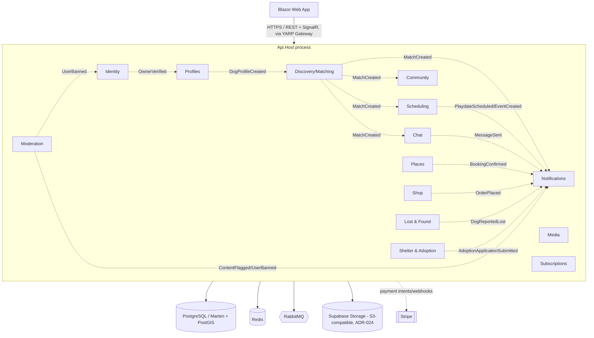
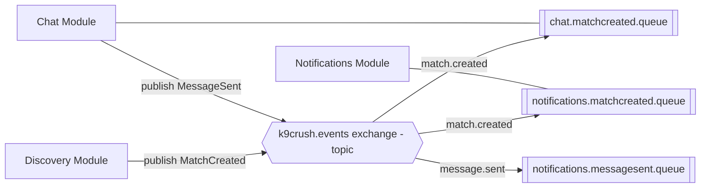
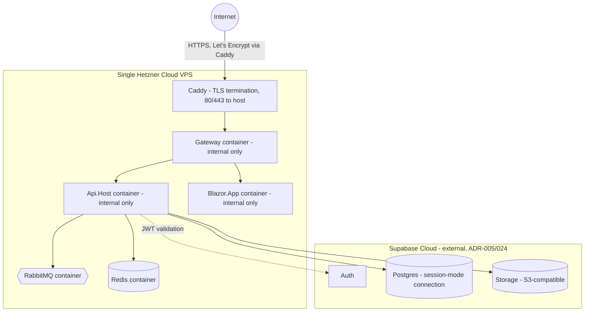
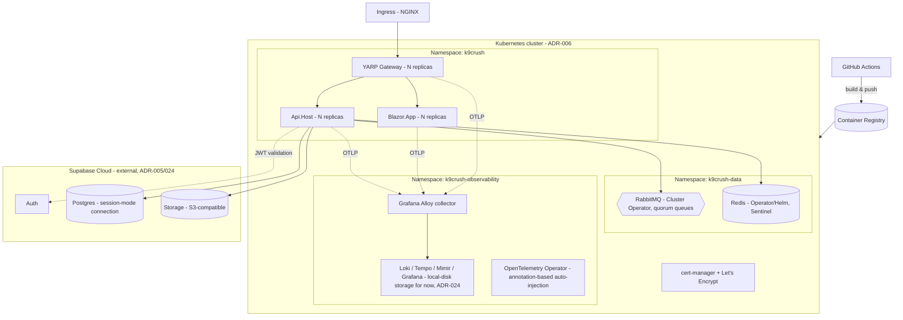

# Solution Architecture Document — K9Crush Platform

## 1. Architectural Style
**Modular Monolith** using **Vertical Slice Architecture** inside each module, deployed as a small number of containers rather than dozens of microservices — while keeping module boundaries strict enough to extract a module into its own service later with minimal rework.

Core principles:
1. **One deployable, many modules.** The `Api.Host` composes all business modules into a single ASP.NET Core process (or a small number of processes — see Section 7 for the split option).
2. **Vertical slices, not horizontal layers.** Each feature (e.g., "Like a Dog", "Send Chat Message") is a self-contained folder with its request, handler, validator, and response — not spread across a `Controllers/`, `Services/`, `Repositories/` layer cake.
3. **Module isolation at compile time.** Modules only reference each other's `Contracts` project (DTOs + integration events). No module references another module's `Domain` or `Infrastructure` project. Enforced via architecture tests in CI.
4. **In-process calls within a module; async events across modules.** A slice in the Discovery module never calls into Chat's domain directly — it publishes an integration event (`MatchCreated`) that Chat subscribes to. **Wolverine** is the single library for both paths: the same handler method signature works whether the message is dispatched in-process or delivered over RabbitMQ, so a slice's business logic doesn't change shape depending on who's calling it.
5. **Marten as the event store for every module (ADR-031, 2026-07-24)** — event sourcing is the default persistence model, not a per-module choice. See Section 2.1.
6. **Command validation state is never a shared aggregate bundle (ADR-019).** This is a stricter rule than "event-sourced modules use aggregates" — it governs *what a command handler is allowed to load*. A DDD-style aggregate root that bundles every field an entity could ever have (status, items, payment info, timestamps, everything) is a **query read model wearing a command's clothes**. Each command gets its own minimal state projection, computed live from only the events it actually needs to make its decision, never persisted as a shared snapshot and never reused by a second command handler. See Section 2.2.

## 2. Module Map & Boundaries



Dotted lines = async integration events via RabbitMQ (through the outbox). Solid lines = synchronous infrastructure dependencies. This diagram intentionally omits some lower-traffic event edges (e.g. every module that emits something Moderation might act on) for readability — the full event catalog belongs in each module's README, not this diagram.

### 2.1 Event-sourced by default (ADR-031), all 5 live modules

**Superseded 2026-07-24.** The table below used to classify each module as Document vs. Event-sourced on a case-by-case basis (14 modules at the time). That per-module choice is gone: **event sourcing is now this app's default persistence model for every module**, decided explicitly rather than derived module-by-module — see ADR-031's row in Section 10 for the full reasoning, including why the earlier per-module classification approach (below, kept for history) is superseded rather than merely extended.

It's also worth noting the module count itself has changed since this table was first written: the 2026-07-24 product descope removed Discovery/Matching, Chat, Places, and Moderation entirely (Profiles was merged into Shelter & Adoption), and Scheduling/Community/Shop/Lost & Found/Subscriptions were never built. The 5 modules actually live today are Identity, Shelter & Adoption, Notifications, Media, and Admin — all being retrofitted to event-sourced per ADR-031's phased plan (Media → Admin → Notifications → Identity → Shelter & Adoption, smallest/simplest to largest/most complex).

| Module | Marten style | Why |
|---|---|---|
| Identity | **Event-sourced** (ADR-031) | Was: thin document projection over Supabase's user lifecycle (ADR-005). Now event-sourced like everything else - the account-deletion grace-period saga and role-promotion history become first-class stream data instead of overwritten flags. |
| Shelter & Adoption | **Event-sourced** (ADR-031) | Was: current-state documents (listings + applications). Now event-sourced - the module's own richest state machines (Application, DogListing's foster/surrender cycles) gain full transition history for free. |
| Notifications | **Event-sourced** (ADR-031) | Was: current-state log + preferences. Now event-sourced, including a per-entity design decision (recorded per-phase, not here) on whether `NotificationTemplate`'s pessimistic-locking fields become part of the event stream or are replaced by Marten's own optimistic-concurrency mechanics. |
| Media | **Event-sourced** (ADR-031) | Was: current-state asset metadata. Now event-sourced - simplest module in the app, used as the retrofit's proof-of-concept phase. |
| Admin | **Event-sourced** (ADR-031) | Was: current-state feedback inbox. Now event-sourced - notable as the first phase where a stream's first event originates from a cross-module automation trigger rather than a local command. |

<details>
<summary>Original per-module classification table (superseded, kept for history)</summary>

| Module | Marten style | Why |
|---|---|---|
| Identity | Document | Thin projection over Supabase's user lifecycle (ADR-005) - current-state only, plus the ADR-017 role-lookup table |
| Profiles | Document | Current-state dog/owner data |
| Discovery/Matching | Event-sourced | Swipe/match history and provenance are first-class data |
| Scheduling | Document, with a lightweight status-history array | Playdate/event lifecycle (proposed → accepted → completed) is meaningful but low-volume enough that a document with an embedded history is simpler than a full stream |
| Community | Document | Feed posts, likes, follows - current-state, high read volume, projections favor plain documents |
| Chat | Event-sourced | Full message/read-receipt history is exactly what event sourcing is for |
| Places | Document | Listings + reviews - current-state |
| Shop | Event-sourced (order lifecycle) + Document (catalog) | Orders are a natural state machine (Placed → Paid → Shipped → Delivered) worth full history for disputes/support; product catalog itself is plain document CRUD |
| Lost & Found | Event-sourced | A report's sighting history accumulates over time and the sequence matters for reunification |
| Shelter & Adoption | Document | Listings + applications - current-state |
| Notifications | Document | Log + preferences - current-state |
| Media | Document | Asset metadata - current-state (the binary itself lives in Supabase Storage, not Marten) |
| Subscriptions | Document | Current-state entitlement |
| Moderation | Document | Reports/cases - current-state, though could move to event-sourced later if audit trail requirements grow |

</details>

**Rule of thumb for choosing sync vs async between modules:**
- If module B *needs to react* to something in module A but doesn't need an immediate answer → integration event (async, via RabbitMQ).

### 2.2 Command State vs. Query Read Models (ADR-019)

Two different things have been getting conflated as "the aggregate," and they need to stay separate:

| | Command State | Query Read Model |
|---|---|---|
| Purpose | Validate one specific command's preconditions | Serve UI/processor queries |
| Shape | Minimal — only the fields that command's decision needs | Rich — whatever the screen needs |
| Ownership | Exactly one command handler | Shared by whoever queries it |
| Persistence | **Never persisted** — computed live from the stream per invocation (`session.Events.AggregateStreamAsync<TState>(streamId)`) | Persisted Marten document/projection, kept current by a state-view slice's projector |
| Naming | `[CommandName]State` (implemented) or `[CommandName]StateToDo` (planned, not yet built) | Named after what it displays (`DiscoveryFeedItem`, `ConversationTranscript`) |

**The state-view lane from ADR-008 (`EVENT(s) → READMODEL → SCREEN`) is entirely about the right-hand column above and is unaffected by this rule.** What changes is the *left* side — the state a command handler loads to decide whether to accept or reject, which was previously modeled the same way as a query read model (a persisted Marten snapshot) and shouldn't be.

**Original incident this rule was written to prevent** (worked example kept for history — `MatchAggregate`/`DetectMutualMatchHandler` lived in the Discovery module, deleted in the 2026-07-24 product descope, so neither exists in the codebase any longer): `MatchAggregate` bundled `DogAId`, `DogBId`, `DogALiked`, `DogBLiked`, `IsMatched`, `MatchedAt`, and `Version` into one Marten inline-snapshot type, and `DetectMutualMatchHandler` loaded the whole thing — a DDD-aggregate-shaped bundle doing command-state duty. The fix was: remove the persisted snapshot entirely; replace it with a minimal `DetectMutualMatchState` built live via `AggregateStreamAsync<DetectMutualMatchState>`, never stored; keep the deterministic stream-id helper (`StreamIdFor`) separate from state projection, since computing a stream id isn't the same concern as projecting state from that stream.

**ADR-031 sharpens this rule rather than loosening it.** Now that every module is event-sourced and read models commonly reuse the same self-aggregating class for both `FetchForWriting` (write) and `Projections.Snapshot` (read) — see ADR-031 — the `MatchAggregate` mistake becomes *easier*, not harder, to make by accident: a command handler calling `session.LoadAsync<T>()` against the shared snapshot type instead of `session.Events.FetchForWriting<T>()` compiles fine and looks correct. ADR-031's fitness-test work (a Mono.Cecil IL-scan, since NetArchTest's declarative dependency-graph API can't tell the legitimate path from the illegitimate one when both reference the identical type) exists specifically to catch this mechanically, going forward, in a world where the old textual clue ("don't load a *different* snapshot type from inside a command") no longer applies.

This discipline applies to every command in every module: when a new command needs to validate against stream history, it gets its own `[CommandName]State`, computed live, not a shared aggregate — regardless of whether that aggregate happens to also be registered as a read-side snapshot elsewhere.

**Cross-stream queries are a different case, not a violation.** A command validating against a *population* of other entities (not a persisted snapshot of the same entity it's about to mutate) — e.g. Shelter & Adoption's `SubmitApplicationHandler` checking an applicant's existing open applications via `session.Query<Application>()` — is the same pattern query read models already use, not the `MatchAggregate` mistake. ADR-019 governs a command loading a shared snapshot *of itself* in place of live-computed minimal state; it was never a blanket ban on cross-entity population queries for validation.
- If module B *needs data owned by* module A to render a response right now → either (a) module B keeps its own read-model copy updated via events (preferred, avoids runtime coupling), or (b) a narrow, versioned internal HTTP call to A's public API (used sparingly, e.g., Media serving a signed URL).

## 3. Module Internal Structure (Vertical Slice)

> **Superseded in detail by `docs/05-event-modeling-blueprint.md` (ADR-008).** The folder convention below is the current one: `Commands/`, `ReadModels/`, and `Automations/` replace the original flat `Features/` folder, and each slice is constrained to exactly one of state-change, state-view, or automation. What follows is kept for the general shape; see the blueprint doc for the authoritative rule and the worked example of splitting a command that had accidentally absorbed automation logic.

Example: `Modules/Discovery`

```
K9Crush.Modules.Discovery.Api/
├── Features/
│   ├── SwipeOnDog/
│   │   ├── SwipeOnDog.cs               (command record)
│   │   ├── SwipeOnDogHandler.cs        (static Handle method: [WolverinePost] route + validation + logic + returns response & MatchCreated event, in one place)
│   │   └── SwipeOnDogValidator.cs
│   ├── GetDiscoveryFeed/
│   │   ├── GetDiscoveryFeed.cs         (query record)
│   │   └── GetDiscoveryFeedHandler.cs  ([WolverineGet] route + query logic)
│   └── UndoLastSwipe/
│       └── ...
├── IntegrationEvents/
│   ├── Consumers/
│   │   └── DogProfileCreatedConsumer.cs
│   └── Published/
│       └── MatchCreated.cs
├── Module.cs                          (IModuleInstaller: DI registration, endpoint mapping)
└── DiscoveryModuleDbConfig.cs         (Marten schema/index config for this module)

K9Crush.Modules.Discovery.Domain/
├── Aggregates/
│   └── SwipeSession.cs / MatchAggregate.cs
├── Events/
│   ├── DogLiked.cs
│   ├── DogPassed.cs
│   └── MatchFormed.cs
└── ValueObjects/
    └── GeoCoordinate.cs

K9Crush.Modules.Discovery.Infrastructure/
├── MartenDiscoveryStore.cs
└── ExternalGeoServiceClient.cs

K9Crush.Modules.Discovery.Contracts/
└── (public DTOs + integration events other modules may reference)
```

Each module exposes a single `Module.cs` implementing a shared `IModuleInstaller` interface. `Api.Host`'s `Program.cs` discovers and wires these at startup — this is the only place that "knows about" every module.

## 4. Data Architecture

- **All reads and writes go to the Postgres primary (ADR-021)** — no replica read-routing. Supabase's managed Postgres (ADR-024) offers its own read replicas on paid tiers for HA/scale, not that this project is using them; every Marten session in this codebase, command or query, talks to primary by default and nothing should override that without a deliberate, documented exception.
- **Marten's connection targets Supabase's session-mode/direct Postgres connection string, not the default transaction-mode pooled one (ADR-024).** The async daemon's advisory-lock-based leader election needs session-level connection behavior that transaction-mode pooling doesn't reliably provide.
- **Single Postgres cluster, one Marten `DocumentStore` per module** (or one store with per-module schema via Marten's multi-tenancy-by-schema feature) — keeps module data physically isolated even inside one database, so a future split to separate databases is a config change, not a data migration.
- **Document-centric modules** (Identity, Profiles, Subscriptions, Moderation): Marten used as a document DB — `session.Store<DogProfile>()`, projections built with `Include()`/compiled queries as needed.
- **Event-sourced modules** (Discovery/Matching, Chat): Marten event store — aggregates like `MatchAggregate` and `ConversationAggregate` are event streams (`DogLiked`, `DogPassed`, `MatchFormed`, `MessageSent`, `MessageRead`); async daemon projections build read models (e.g., `MatchSummary`, `ConversationTranscript` flat documents) for fast querying. This is deliberate for both modules: match history and full message/read-receipt history are exactly the kind of "what happened, in what order, and can we prove it" data event sourcing is built for — versus Identity/Profiles/Subscriptions/Media/Moderation, which are current-state-oriented and stay as plain Marten documents.
- **Outbox pattern**: domain events that need to leave the module are written to an outbox document/table in the *same* Marten session/transaction as the domain change, then a background dispatcher publishes them to RabbitMQ and marks them sent — guarantees no event is lost if the process crashes between DB commit and publish.
- **Geo queries**: dog owner location stored as lat/long; discovery feed queries use PostGIS (`geography` type) via Marten's raw SQL/linq extension support, or Marten's built-in spatial querying if sufficient for MVP radius search.

## 5. Messaging Architecture (RabbitMQ)



- **Topic exchange** (`k9crush.events`) with routing keys like `match.created`, `message.sent`, `content.flagged`. Wolverine's RabbitMQ transport maps this via `PublishMessage<T>().ToRabbitExchange("k9crush.events")` conventions, configured once in `Api.Host` composition.
- Each consumer module owns its own durable queue bound to the events it cares about — publishers never know who's listening (loose coupling). A module's Wolverine handler for an integration event looks identical to a handler for a local command (`public static Task Handle(MatchCreated evt, ...)`), so there's no special "consumer" ceremony to learn.
- **Dead-letter queues** per consumer queue for poison messages; alerting on DLQ depth. Wolverine's built-in retry/error-handling policies (`OnException<T>().RetryWithCooldown(...)`, then move-to-dead-letter) cover this without extra infrastructure code.
- **Durable inbox/outbox via `WolverineFx.Marten`**: outgoing messages are written to Wolverine's envelope tables in the *same* Postgres transaction as the Marten session that recorded the domain change (no separate outbox document to maintain by hand, as would be needed with a bare messaging library), and incoming messages are deduplicated by envelope ID automatically — Wolverine handles the idempotency, so handlers don't need to.
- Message contracts versioned (`MatchCreatedV1`) and live in each module's `Contracts` project — the only cross-module compile-time dependency allowed.

## 6. Caching Architecture (Redis)

| Use case | Pattern |
|---|---|
| Discovery feed caching | Cache-aside, short TTL (30–60s) per user, invalidated on new swipe |
| Session/auth token cache | `IDistributedCache` for token introspection results |
| SignalR backplane | `AddStackExchangeRedis()` for Chat hub scale-out across replicas |
| Rate limiting | Redis-backed sliding window (e.g., via `Microsoft.AspNetCore.RateLimiting` + custom Redis store) for swipe/report endpoints |
| Output caching | ASP.NET Core Output Cache with Redis store for read-heavy, low-personalization endpoints (e.g., public profile view) |

## 7. Deployment Architecture

Two deployment targets exist in this document now, deliberately not one: **7.1 is the current MVP target (ADR-025)** — what's actually running. **7.2 is the later-scale target (ADR-006)** — Kubernetes, not yet built, still the plan for when Hetzner-single-box stops being enough. Don't read the Kubernetes diagram as "what we're deploying now" — that's the mistake this restructure is meant to prevent.

### 7.1 MVP Deployment (current target — ADR-025)



- **One box, six containers**: `docker-compose.prod.yml` runs `caddy`, `gateway`, `api-host`, `blazor-app`, `rabbitmq`, `redis` on a single Hetzner Cloud VPS. Only `caddy` is exposed to the host (80/443); everything else, including `gateway`, is reached over the internal Docker network only.
- **Sizing**: not load-tested, but a reasonable starting point for early MVP traffic is a Hetzner **CX32** (4 vCPU / 8GB) or **CX42** (8 vCPU / 16GB) — six containers including two message-broker/cache processes will want headroom beyond the smallest instance types. Resize once you have real traffic data rather than guessing further.
- **TLS via Caddy (built)** — `caddy` (`deploy/compose/Caddyfile`) terminates HTTPS and reverse-proxies to `gateway:8080`, requesting/renewing its own Let's Encrypt certificate for whatever hostname `DOMAIN` (in `.env`) is set to. Requires that DNS A record to already point at the box before first start (ACME HTTP-01 challenge needs port 80 reachable), and ports 80+443 open in whatever firewall/security-group sits in front of the VPS.
- **No backup story for the self-hosted RabbitMQ/Redis Docker volumes.** Postgres and Storage are Supabase's problem now (ADR-024) — RabbitMQ and Redis are not. On a single box, "the disk dies" means that data is gone. RabbitMQ's data is largely transient (in-flight messages, not a system of record) so this is lower-stakes than it sounds, but worth a conscious decision rather than an accidental one — at minimum, Hetzner's own volume snapshot feature is a cheap first step.
- **CD via `.github/workflows/cd.yml` (built)** — triggers on CI succeeding on `main` (`workflow_run`, not its own push trigger, so a failing CI run never reaches deploy). Builds the 3 app images, pushes them to GHCR tagged with the commit SHA and `latest`, then SSHes into the Hetzner box to `docker compose pull && docker compose up -d` the new tag. The `deploy` job runs under a GitHub Environment named `production` — needs `HETZNER_HOST`/`HETZNER_USER`/`HETZNER_SSH_KEY` configured as environment secrets, and optionally a required reviewer for a manual approval gate. One-time box setup this assumes: `~/k9crush/.env` created by hand from `.env.example` (including `DOMAIN`), Docker installed, the deploy user able to run `docker compose` (in the `docker` group or passwordless sudo). If the GHCR packages default to private on first push, either make them public (repo is public) or `docker login ghcr.io` on the box with a PAT that can read packages, or `pull` will fail with an auth error.
- **Single point of failure, accepted deliberately for this stage.** One box means one place for the app, RabbitMQ, and Redis to all go down together. That's the actual trade being made by choosing Hetzner+Compose over Kubernetes for MVP — cheaper and simpler now, in exchange for exactly the kind of resilience ADR-006's operator ecosystem would have provided. Worth revisiting once uptime actually matters to the business, not as a reaction to an outage.

### 7.2 Later-Scale Deployment (Kubernetes — ADR-006, not yet built)



- **Three deployable images**: `K9Crush.Gateway` (YARP, public entry point), `Api.Host` (all backend modules in one process), and `Blazor.App` (frontend). The gateway is the only one exposed by the ingress; `Api.Host` and `Blazor.App` are internal-only ClusterIP services it routes to.
- **Data tier is partly self-hosted in-cluster, partly Supabase-managed (ADR-011/024)** — the operators remaining in-cluster are still the reason Kubernetes was chosen over Azure Container Apps (ADR-006), though that justification is lighter than it was:
  - **Postgres**: no longer in this cluster. Supabase-managed (ADR-024) — connect via its session-mode connection string, not the default transaction-mode pooled one (Marten's advisory-lock-based leader election needs session-level behavior). Backups are Supabase's responsibility, not ours.
  - **RabbitMQ**: official RabbitMQ Cluster Operator, quorum queues for durability across pod restarts/rescheduling.
  - **Redis**: Operator (or Bitnami Helm chart) running primary/replica with Sentinel for failover; SignalR backplane and cache traffic both tolerate a brief failover window, so full active-active isn't needed for MVP.
  - **Storage**: no longer MinIO/no longer in this cluster. Supabase Storage (ADR-024) — S3-compatible, accessed the same way `AWSSDK.S3` always would be, just pointed at Supabase's endpoint. The Grafana LGTM stack (below) does **not** use this as its backing store; see ADR-024's flagged risk on that.
- Horizontal scaling: the three application deployables are stateless (session state in Redis, SignalR backplane in Redis), so replicas scale independently behind the gateway. The data tier scales/fails over via its respective operator, not manually.
- Config via environment variables / mounted secrets (12-factor); no config baked into images.
- Health checks (`/healthz/live`, `/healthz/ready`) per deployable, checking Postgres, Redis, RabbitMQ connectivity for readiness.
- **TLS**: cert-manager + Let's Encrypt issues and rotates certificates for the ingress automatically — no manual cert handling.
- **CD (ADR-013)**: GitHub Actions authenticates to the cluster directly (via cloud OIDC federation where the cluster is cloud-hosted, otherwise a scoped kubeconfig held as a GitHub encrypted secret) and runs `helm upgrade`/`kubectl apply` after each build — no GitOps controller in the loop. This is simpler to reason about with a small team, at the cost of no automatic drift detection between what's in Git and what's actually running; worth revisiting if the cluster ever gets manual `kubectl` changes applied outside the pipeline. Note this deploy credential is a CI bootstrap secret held in GitHub itself, not synced via ESO/Vault — ESO's scope is secrets *inside* the cluster for the running application, not CI's own access to reach the cluster in the first place.

### 7.3 Future split option
Because modules only communicate via events/contracts, a module suspected of needing independent scaling (e.g., Chat, under real-time load) can be pulled into its own container image later — same code, just a different `Program.cs` composition root that hosts only that module. This is the primary payoff of the modular-monolith-first approach. Applies whichever deployment target is current — it's a code-structure benefit, not specific to Kubernetes.

### 7.4 Operational cost of self-hosting what's left (ADR-011) — read this before Phase 1
As of ADR-024, self-hosted responsibility is down to RabbitMQ and Redis (plus the Grafana LGTM stack, which is more a monitoring workload than a data-durability one) — Postgres and object storage moved to Supabase's managed SLA, and Auth already was. That's a real reduction from the original six-system ops burden, not just a relabeling: patching, upgrade, and backup-verification responsibility for the two highest-stakes stateful systems (the primary database, and everything users upload) now sits with Supabase rather than this team. What's left (RabbitMQ, Redis) is still real work — quorum-queue operational knowledge, Redis failover testing — and should stay an explicit line item in the Project Plan's Phase 1 estimate, just a smaller one than originally scoped.

## 8. Security Architecture
- **AuthN**: JWT bearer tokens issued by Identity module (or external IdP). Blazor uses `AuthenticationStateProvider` backed by the token.
- **AuthZ**: Policy-based (`[Authorize(Policy = "VerifiedOwner")]`) at the endpoint level per slice. **Role model expanded (ADR-017)**: `Api.Host` now resolves Owner/Vendor/Shelter/Admin roles via its own Postgres lookup keyed by the Supabase JWT's `sub` claim, not just a single authenticated-user shape - Shop and Places endpoints that manage a listing require `Vendor`, Shelter & Adoption's org-side endpoints require `Shelter`, and existing dating/social endpoints stay on the original `VerifiedOwner` policy unchanged.
- **Transport**: TLS everywhere (ingress terminates TLS via cert-manager; optionally mTLS between ingress and pods).
- **Secrets**: never in source/images. **External Secrets Operator (ESO)** syncs secrets from a self-hosted **HashiCorp Vault** into native K8s Secrets — consistent with ADR-011's self-hosting direction rather than a cloud secrets manager. Application deployables only ever see the resulting K8s Secret; nothing in-cluster talks to Vault directly except ESO itself, which keeps the Vault token/AppRole credential blast radius to one component.
- **Payments (ADR-015)**: Stripe Checkout/Elements only - card data never touches K9Crush's servers, keeping PCI scope to SAQ-A. Webhook signatures verified before processing; webhook handlers are idempotent (Wolverine inbox) since Stripe retries on any non-2xx response.
- **Media**: signed, time-limited URLs for photo/video access; upload validated (file type/size) before persisting.
- **Rate limiting & abuse prevention**: per-user swipe-rate limits, report-abuse throttling, CAPTCHA on registration.
- **Data privacy**: location data stored at reduced precision for discovery display; full precision only used server-side for distance calculation.

## 9. Observability (ADR-010: Grafana LGTM + Alloy, zero-code instrumentation)
- **Zero-code instrumentation, Kubernetes-native path**: now that ADR-006 has settled on Kubernetes, the **OpenTelemetry Operator**'s annotation-based auto-injection (`instrumentation.opentelemetry.io/inject-dotnet: "true"` on the pod spec) replaces baking the auto-instrumentation agent into each Dockerfile — genuinely zero code *and* zero Dockerfile changes, centrally upgradable by bumping the `Instrumentation` custom resource rather than rebuilding every image. The Dockerfile/env-var mechanics in the Inventory doc's Section 7 remain the documented fallback for local `docker-compose` (which has no operator to do the injection), so local dev and cluster deployments use the same OTel SDK, just different injection mechanisms.
- **Collector**: Grafana **Alloy** receives OTLP (traces, metrics, logs) from every deployable and routes it to the LGTM components. Locally, the single `grafana/otel-lgtm` container stands in for Alloy + the whole backend, so a developer gets working dashboards with zero setup; production runs Alloy and the LGTM components as separately-scaled workloads.
- **Storage/query backends**: **L**oki (logs), **T**empo (traces), **M**imir (metrics, Prometheus-compatible), unified in **G**rafana with trace-to-logs and trace-to-metrics correlation via exemplars — so a slow request in a dashboard can be clicked through to its trace and the logs emitted during that trace.
- **Correlation across the async boundary**: Wolverine propagates W3C trace context through message envelope headers (both local dispatch and RabbitMQ), so a trace started by `SwipeOnDog`'s HTTP request continues through the `DetectMutualMatch` automation and into whatever `MatchCreatedV1` triggers downstream — the whole "swipe → match → notify" flow shows up as one trace in Tempo, not three disconnected ones.
- **Manual spans where they add value**: business-meaningful spans (e.g. wrapping the mutual-match decision) use the plain `System.Diagnostics.ActivitySource` API, registered via `OTEL_DOTNET_AUTO_TRACES_ADDITIONAL_SOURCES` so they merge into the same trace the auto-instrumentation is already building.
- **Dashboards & alerts**: SLO-based alerting (P95 latency, RabbitMQ queue depth, DLQ growth) built in Grafana against Mimir; log-based alerts against Loki for error-rate spikes. Postgres connection saturation is now visible via Supabase's own dashboard rather than our Prometheus scraping, since it's no longer in-cluster (ADR-024) - worth linking from our Grafana dashboards rather than duplicating. The remaining self-hosted data-tier operators (RabbitMQ Cluster Operator, Redis Operator) still expose Prometheus metrics and should be watched the same as any other in-cluster workload.

## 10. Key Architecture Decisions (ADR summary — full ADRs in `docs/adr/`)

| ADR | Decision | Status |
|---|---|---|
| ADR-001 | Modular monolith over microservices for MVP | Proposed |
| ADR-002 | Mediator/messaging library: Wolverine (with `WolverineFx.Marten` outbox/inbox) | **Decided** |
| ADR-003 | **Schema-per-module applies to Marten *documents*, not the event store.** Each module's Inline-snapshot/read-model documents (`mt_doc_*`) live under their own Postgres schema (`identity`, `shelteradoption`, `notifications`, `admin`; `media` currently has none registered) - real per-module isolation, and Marten genuinely supports this via a per-type `options.Schema.For<T>().DatabaseSchemaName(...)` call. The event store (`mt_events`/`mt_streams`) is a **single shared schema for the whole app** (`eventstore`), configured once in `Api.Host/Program.cs` - Marten has exactly one event-store schema per `StoreOptions`/database, it does not partition the event log by module, so "schema-per-module" was never achievable for events the way the original framing implied. Originally decided as a blanket "schema-per-module vs database-per-module" choice without this distinction; corrected 2026-07-30 after a live bug (every module's `Configure()` independently setting `options.Events.DatabaseSchemaName`, a single shared property on one `StoreOptions` instance - the last-registered module silently won for every module's events, and separately, Inline-snapshot documents were never given their own per-type schema call at all and defaulted to Postgres's `public` schema) - see `marten_schema_isolation_bug` session memory for the full incident. `public` being Supabase's PostgREST-exposed-by-default schema meant this was briefly a real (if narrow) data-exposure gap, not just a tidiness issue - RLS was enabled on the affected tables live before the root cause was fixed. | **Decided** |
| ADR-004 | Blazor render mode: Server vs WASM vs Auto | Proposed: Auto (per-component) |
| ADR-005 | Identity: **Supabase Cloud (Auth)**, superseding the earlier Keycloak decision. Identity module remains a thin projection over the IdP's user lifecycle, not a credential store — that part of the original rationale is unchanged, only which IdP applies. Supabase chosen for covering more ground than pure auth (also offers Postgres, Storage, Realtime) though this project only adopts its Auth piece for now — see ADR-023 for why the rest isn't adopted alongside it. | **Decided (superseded ADR-005 original)** |
| ADR-006 | Container platform: **Kubernetes**, decided — originally justified partly by the CloudNativePG and MinIO Operators; both are superseded by ADR-024 (Postgres/Storage now Supabase-managed), so the remaining justification is the RabbitMQ Cluster Operator, Redis Operator, OpenTelemetry Operator, and cert-manager. Still enough to justify K8s over Azure Container Apps, but worth being honest that the original rationale weakened rather than pretending nothing changed. | **Decided** |
| ADR-007 | Gateway: YARP (.NET-native reverse proxy) in front of Api.Host + Blazor.App, rather than Kong | **Decided** |
| ADR-008 | Vertical slices are further constrained to exactly one of state-change/state-view/automation (Event Modeling discipline) — see `docs/05-event-modeling-blueprint.md` | **Decided** |
| ADR-009 | ~~Object storage: MinIO (self-hosted, S3-compatible)~~ **Superseded by ADR-024**: object storage is now Supabase Storage (managed, S3-compatible). Kept for history — the original single-node-durability caveat is exactly the kind of ops risk this reversal avoids. | **Superseded (see ADR-024)** |
| ADR-010 | Observability: Grafana LGTM (Loki/Grafana/Tempo/Mimir) fed by Grafana Alloy, with zero-code OpenTelemetry .NET auto-instrumentation (no SDK code in `Program.cs`) | **Decided** |
| ADR-011 | Data tier: **RabbitMQ (RabbitMQ Cluster Operator) and Redis (Redis Operator/Helm) remain self-hosted in-cluster.** Postgres is superseded by ADR-024 (now Supabase-managed) — no longer self-hosted via CloudNativePG, no longer needs a PITR-to-MinIO backup target since Supabase handles Postgres backups on its own managed side. | **Decided (Postgres portion superseded — see ADR-024)** |
| ADR-012 | Secrets: External Secrets Operator syncing from a self-hosted HashiCorp Vault into K8s Secrets, rather than a cloud secrets manager | **Decided** |
| ADR-013 | CD strategy: push-based — GitHub Actions runs `helm upgrade`/`kubectl apply` directly against the cluster after building images — rather than GitOps (ArgoCD/Flux watching a manifests repo) | **Decided** |
| ADR-014 | PostGIS enabled from Phase 1 (not deferred) - Places, Lost & Found, and Discovery all need real proximity queries at once rather than the earlier bounding-box/Haversine placeholder | **Decided** |
| ADR-015 | Payments: Stripe Checkout/Elements for Shop and Subscriptions - K9Crush never stores raw card data; webhook-driven confirmation consumed idempotently via Wolverine's inbox | **Decided** |
| ADR-016 | Video: async FFmpeg-based transcoding worker triggered off `MediaUploaded`, storing outputs back to Supabase Storage (superseding the original MinIO target per ADR-024) - no managed transcoding service for Train C, revisit if volume grows | **Decided** |
| ADR-017 | Identity roles: **role dimension (Owner / Vendor / Shelter / Admin) is looked up from our own Postgres, not carried as a Supabase custom claim.** Originally scoped as "Keycloak realm gains a role dimension" - Keycloak's realm-role model doesn't exist in Supabase. Supabase's equivalent (a Custom Access Token Hook injecting claims from Supabase's *own* managed Postgres) would mean the source of truth for roles lives in Supabase's database, requiring role data to be duplicated/synced there. Instead, `Api.Host` resolves the caller's role via a lookup against our own self-hosted Postgres (ADR-011), keyed by the `sub` claim from the validated Supabase JWT - single source of truth stays in our own data, at the cost of one extra lookup per authorization check (cacheable in Redis if it becomes a hot path). Revisit if this becomes a real bottleneck. | **Decided** |
| ADR-023 | ~~Supabase adoption is scoped to Auth only~~ **Superseded by ADR-024** one turn later — Postgres and Storage moved to Supabase too, so the "Auth only" framing no longer holds. Kept for history since the reasoning (avoid one convenient managed service quietly absorbing decisions made deliberately elsewhere) is still worth reading even though the conclusion changed. | **Superseded (see ADR-024)** |
| ADR-024 | **Supabase scope expanded to Auth + Postgres + Storage**, replacing self-hosted CloudNativePG Postgres (ADR-011) and self-hosted MinIO (ADR-009) entirely. This actually resolves ADR-023's "two separate Postgres instances" tension rather than deepening it — there's now one Postgres (Supabase's), not two. RabbitMQ and Redis are unaffected and remain self-hosted per ADR-011. Two things this creates that need explicit attention, not just a config change: <br>**(1) Connection pooling mode matters for Marten.** Marten's async daemon uses Postgres advisory locks for projection/subscription leader election. Supabase's default pooler (Supavisor) can run in transaction mode, which doesn't reliably support session-level features like advisory locks. Use Supabase's session-mode/direct connection string for the app's Postgres connection, not the default transaction-mode pooled one — get this wrong and the failure is subtle (leader election misbehaving silently) rather than an obvious startup error. <br>**(2) The Grafana LGTM stack (ADR-010) loses its MinIO backing store.** Loki/Tempo/Mimir were architected to reuse the self-hosted MinIO instance for their own object storage. Supabase Storage's S3 compatibility is confirmed for general use, but hasn't been verified against Loki/Tempo/Mimir's specific requirements (more demanding than typical file storage - prefix listing patterns, write consistency). **Default here: run LGTM components with local-disk storage for now, deferring the object-storage decision** rather than forcing an immediate Supabase-Storage-vs-keep-a-small-MinIO-just-for-this choice - revisit once retention/durability requirements are clearer. Flagged, not silently decided; override if you'd rather resolve it now. <br>**Update 2026-08-20 — Postgres portion temporarily reverted for build-out:** the Postgres leg of this ADR is on hold while active slice development is underway. `ConnectionStrings:Postgres` points at a local `postgres:16` container (`deploy/compose/docker-compose.yml`) instead of Supabase-managed Postgres, for fast local iteration without a network dependency — see commit "chore: run Postgres locally instead of Supabase-managed during build-out" and `GETTING_STARTED.md` Step 1. Storage and Auth are unaffected and remain Supabase-managed as decided here. This is a deliberate, temporary deviation, not a supersession — the plan is to revert to Supabase-managed Postgres before shipping, at which point this ADR's original Postgres guidance (session-mode pooler, not transaction-mode) applies unchanged. See also open issue #59, which is evaluating whether a lightweight local-Postgres-for-dev / Supabase-for-prod split should become the permanent shape instead of a build-out-only exception - if that lands, this ADR gets a real supersession entry, not just this note. | **Decided (Postgres leg temporarily reverted for build-out — see update)** |
| ADR-025 | **MVP hosting: a single Hetzner Cloud VPS running `docker-compose.prod.yml` directly** (caddy, gateway, api-host, blazor-app, rabbitmq, redis) — not the Kubernetes/Helm/operator setup from ADR-006/011. This does **not** reverse ADR-006; Kubernetes remains the target once scale, HA, or team size actually justifies the operational complexity. Hetzner+Compose is explicitly the MVP-stage choice: cheapest path to a real public deployment, single point of failure accepted deliberately for this stage. TLS (Caddy) and CD (`cd.yml`, build->GHCR->SSH-pull) are now both built, superseding ADR-013's Kubernetes-shaped `helm upgrade` assumption for this stage - see Section 7.1. Still not resolved: no automated backup of the self-hosted RabbitMQ/Redis Docker volumes (single-box - if the disk dies, that data is gone, unlike Postgres/Storage which are Supabase's problem now per ADR-024). | **Decided** |
| ADR-032 | **Versioning: semantic versioning (SemVer), computed automatically from Conventional Commits** (already the repo's commit-message convention - `feat:`/`fix:`/`docs:`/etc.) via `semantic-release`, rather than a human manually deciding and tagging `vX.Y.Z`. Runs as the first job in `cd.yml` on every CI-passed push to `main`: `feat:` commits since the last tag bump minor, `fix:`/`perf:` bump patch, a `BREAKING CHANGE` footer bumps major - anything else (docs/chore/ci/build/refactor/test) doesn't cut a release on its own, which is expected, not a bug. When it does release, `.releaserc.json` drives `@semantic-release/github` to push the git tag and publish a GitHub Release with generated notes; `build-and-push` then tags that push's 3 GHCR images with the version too (alongside the commit-sha/`latest` tags it already used), via `docker/metadata-action`'s conditional `enable=` rather than a hand-rolled bash conditional. Deploy is *not* gated on a release having happened - every CI-passed main push still deploys via its sha tag regardless, since "worth a new version number" and "worth deploying" are different questions. No assembly/csproj version stamping (rejected for now - this is a deployed app, not a published NuGet package, so there's no consumer for an assembly version to matter to; revisit if that changes). First-ever release will be `1.0.0` per semantic-release's own convention (no prior tags to diff against), regardless of the commit mix in this repo's existing history. | **Decided** |
| ADR-018 | Content & newsletter: lightweight CMS + third-party email platform (not custom-built) for training/health tips and the newsletter | **Decided** |
| ADR-033 | **Marten schema management strategy per environment: `AutoCreate.CreateOrUpdate` in Development, `AutoCreate.None` everywhere else.** Closes a gap `Program.cs` had explicitly flagged and left unset since the ADR-031 retrofit: Marten 9's "Critter Stack 2026" release renamed the config surface (`Weasel.Core.AutoCreate` → `JasperFx.AutoCreate`, same 4 values), and a past session declined to guess the new API rather than risk silently disabling schema creation. Confirmed correct via reflection against the installed Marten 9.20.1/JasperFx 2.36.2 packages - `StoreOptions.AutoCreateSchemaObjects` still exists under the new type, and the integration test fixtures (e.g. `MediaPostgresFixture`) already used it successfully, just never got ported into `Program.cs` itself. **Consequence this creates, not yet resolved:** with `AutoCreate.None` outside Development, nothing currently applies a schema-affecting change (new document type, new index) anywhere but Development - there is no reviewed migration-generation step in CI. This needs a real answer before any deploy that changes schema, not just before the *first* deploy. (Cross-referenced against PawMatch's own ADR-0005, same Marten/JasperFx stack.) | **Decided** |
| ADR-034 | **Event schema evolution: every event type is immutable once it has shipped past Development.** Evolving an event's shape after that point uses Marten's upcasting (a CLR-type transform, keeping the old type and mapping old->new, or a raw-JSON transform for better performance) - never editing an existing event record's CLR shape in place, which breaks deserialization of every previously-stored event of that type. Naming keeps the `V1`/`V2`-suffix convention already used throughout the codebase (e.g. `OwnerAccountCreatedV1`) as the versioned-rename path, rather than introducing a separate scheme. This formalizes a discipline ADR-031's blanket event-sourcing adoption assumed everywhere but never wrote down as an explicit rule - the single most consequential omission found reviewing PawMatch's equivalent ADR-0007, since event sourcing is now this app's default persistence model for every module, not an occasional technique. | **Decided** |
| ADR-035 | **Soft-delete vs hard-delete: member/owner-facing documents and projections default to soft delete** (`Policies.AllDocumentsSoftDeleted()`), preserving auditability and undo for accidental/erroneous deletes. **Hard delete (`HardDelete()`/`HardDeleteWhere()`) is reserved specifically for an intentional data-removal request** (GDPR/CCPA-style erasure) - never the default behavior of a routine user-initiated "delete." Directly feeds the open [[gdpr_sar_requirement]] Erasure Cascade work: `OwnerAccountPermanentlyDeletedV1` (already in Identity.Domain's event set, per `OwnerAccountEvents.cs`) is the existing hook this policy attaches to once that slice is built. (Cross-referenced against PawMatch's ADR-0017.) | **Decided** |
| ADR-036 | **Event-level PII masking: any event type carrying member/owner PII gets a masking rule registered proactively, in the same PR that introduces it** - via `opts.Events.AddMaskingRuleForProtectedInformation<TEvent>`, applied on demand via `store.Advanced.ApplyEventDataMasking(...)` once an erasure request actually arrives. Concrete examples already in the codebase today: `OwnerAccountCreatedV1`'s `Email`, `OwnerAccountDisplayNameUpdatedV1`'s `DisplayName` (both in Identity.Domain). Masking rules can't be applied retroactively to a request that predates their registration, which is why this is a proactive-by-default review step, not a reactive one triggered by the first real erasure request. A runbook step (apply masking, then rebuild any projection derived from the masked stream, since masking doesn't retroactively update already-built read models) is part of the Erasure Cascade slice itself, not a separate follow-up. Directly feeds [[gdpr_sar_requirement]]. (Cross-referenced against PawMatch's ADR-0018.) | **Decided** |
| ADR-037 | **Marten serialization defaults, made explicit: System.Text.Json (already Marten's default) + `EnumStorage.AsString` + `Casing.Default`/PascalCase (also already default).** `EnumStorage.AsString` was the one setting not actually in effect - grepped, confirmed no explicit `EnumStorage` configuration existed anywhere, meaning the store was silently running on the untouched default, `AsInteger`, which makes stored data opaque and fragile to enum-member reordering. Fixed directly in `Program.cs` (`options.UseSystemTextJsonForSerialization(EnumStorage.AsString)`) alongside this ADR, before any real deployment exists to make the change a data migration instead of a one-line config edit - the same "cheap now, expensive later" window PawMatch's equivalent ADR-0016 describes for exactly this setting. | **Decided** |
| ADR-038 | **Document revision type: any document/projection whose revision counter tracks the store-wide event sequence must implement `ILongVersioned`, not `IRevisioned`.** `IRevisioned` (`int`) silently overflows past `Int32.MaxValue` - a correctness bug that only surfaces at scale and is expensive to retrofit after the fact. This is chiefly a rule for `MultiStreamProjection` read models, whose revision counter is commonly the global event sequence; `IRevisioned` stays acceptable for a counter scoped to a single stream's own version. Grepped: no current K9Crush projection uses either interface yet, so this is a forward-looking rule for the first `MultiStreamProjection` the codebase adds, not a retrofit. (Cross-referenced against PawMatch's ADR-0010.) | **Decided** |
| ADR-039 | **Strong-typed identifiers: every new aggregate/document id is a strong-typed identifier generated via Vogen** (wrapping the underlying `Guid`), not a bare `Guid`, starting from whichever module or aggregate is next touched. Not a blanket retrofit across the 9 existing modules today - that would be a large, low-payoff mechanical change against identifiers already in wide use across handlers, contracts, and tests. Existing bare-`Guid` ids migrate opportunistically as their owning module is touched, the same phased-adoption logic already used for ADR-031's own module-by-module event-sourcing retrofit. Prevents primitive obsession (accidentally passing an `OwnerId` where a `DogListingId` is expected) going forward, cheap to adopt now while module count is still 9, expensive to retrofit once it's 20. (Cross-referenced against PawMatch's ADR-0026.) | **Decided** |
| ADR-019 | Command validation state is per-command, minimal, and computed live from events (`[CommandName]State`) — never a shared, persisted DDD-style aggregate bundle reused across commands. Distinct from query read models (ADR-008's state-view lane), which remain rich and persisted. | **Decided** |
| ADR-040 | **Wolverine.Http is the standard HTTP layer for every module - formalizing what CLAUDE.md and the event-modeling blueprint already require in practice.** Endpoints are `[WolverinePost]`/`[WolverineGet]`/etc.-decorated static methods colocated with their command/query, never a conventional MVC controller. Request validation is `System.ComponentModel.DataAnnotations`/`IValidatableObject` on the request record, never a separate `AbstractValidator<T>`/FluentValidation class - already resolved live, see [[http_validation_gap]] (FluentValidation's pipeline doesn't run for Wolverine.Http endpoints at all; this was discovered the hard way). This ADR exists to put an already-enforced convention into the numbered decision log alongside everything else, not to change anything. (Cross-referenced against PawMatch's ADR-0028.) | **Decided** |
| ADR-041 | **RabbitMQ is the standard external transport for cross-module messaging - formalizing the choice already made in `Program.cs`** (`opts.UseRabbitMq(...).AutoProvision()`, `k9crush.events` fanout exchange per module boundaries memory). Chosen for the same reason PawMatch names: Wolverine's most mature, fully-documented, feature-complete transport integration of the many it supports (Kafka, Azure Service Bus, SQS/SNS, Pulsar, etc.). Postgres-as-transport (same database Marten already uses) is the fallback for any narrow, low-volume need that doesn't justify RabbitMQ - not currently used, but available without new infrastructure if a need arises. (Cross-referenced against PawMatch's ADR-0030.) | **Decided** |
| ADR-042 | **Wolverine code generation: `TypeLoadMode.Dynamic` for local development, `TypeLoadMode.Static` (pre-generated, no Roslyn) for CI-built and deployed artifacts.** Closes a gap `Directory.Packages.props` already flags on its own `WolverineFx.RuntimeCompilation` line ("Dev-time only... production should move to pre-generated static codegen instead of shipping this") - not yet acted on, and now more urgent since `cd.yml` actually ships production images. **Decision, not yet implemented:** add a `dotnet run -- codegen write` step to `cd.yml` before the Docker build, commit the generated output (`Internal/Generated/WolverineHandlers`) to source control so handler-signature changes show up as a reviewable diff, and fail CI if regenerating produces a diff against what's committed (stale generated code is Wolverine's own documented blind spot - it does not detect drift on its own). Static mode also drops `WolverineFx.RuntimeCompilation`'s ~100MB of Roslyn assemblies from the deployed image and removes its cold-start cost. (Cross-referenced against PawMatch's ADR-0029.) | **Decided (policy), not yet implemented** |
| ADR-043 | **Every cross-module integration event gets an explicit `[MessageIdentity("name")]`, decoupling its wire identity from its CLR type name.** Grepped: zero usage today, across every `*.Contracts` project (`ApplicationApprovedV1`, `AccountDeletionRequestedV1`, `DogListingRemovedV1`, etc.) - each currently relies on its bare CLR type name as its wire identity, so renaming any of them later silently breaks wire compatibility for in-flight/dead-lettered messages of the old shape. This is the Wolverine-message analog of ADR-034's event-immutability rule for Marten events - same underlying risk (a persisted/in-transit shape outliving a CLR rename), different mechanism (message identity attribute vs. upcasting). Schema evolution for a message contract itself uses `IForwardsTo<T>` + `RegisterMessageForwarder<TOld,TNew>()` for an old-shape-to-new-shape transform, or multiple `Handle` overloads per version - not decided further than that until a contract actually needs to evolve. (Cross-referenced against PawMatch's ADR-0031.) | **Decided** |
| ADR-044 | **Error handling / dead-letter policy: `Program.cs` already has a real global baseline** (`opts.Policies.OnException<Exception>().RetryWithCooldown(1s, 5s, 30s).Then.MoveToErrorQueue()`) - this ADR makes it the stated policy rather than an implicit default, and adds the one piece missing from it: dead-letter storage is not currently forced to `Durable` anywhere. **Correction against PawMatch's own ADR-0032**, which describes a global `opts.Durability.DeadLetterStorageMode` setting - verified via reflection against the actual installed WolverineFx 6.23.1 that no such global property exists in this version; `DeadLetterStorageMode` is a **per-endpoint** property (`Endpoint.DeadLetterStorage`), and Wolverine's own supported mechanism for applying a setting like this across every endpoint uniformly is a custom `IWolverinePolicy` registered once. **Decision:** a handler/endpoint that needs to deviate from the global retry/backoff (a different retry count, `Discard()` instead of dead-lettering) is an explicit, reviewed exception, not silently inconsistent behavior. | **Decided** |
| ADR-045 | **Saga vs. Marten-aggregate workflow modeling: model a business process as an event-sourced aggregate when the events themselves are the domain record worth keeping; model it as a Wolverine saga (`Wolverine.Saga`, `TimeoutMessage`) when the primary concern is coordinating a multi-step workflow's operational state (which step, what it's waiting for) rather than a domain fact worth recording as an event.** No current K9Crush workflow needs a saga - ADR-026's time-based automations (stale/close application timers) are handled as Wolverine scheduled messages against an aggregate, not saga-coordinated state, and that remains the right call for a single-timer-per-instance shape. This ADR exists so the fork doesn't get decided ad hoc the first time a genuinely multi-step, multi-timeout shelter-ops workflow shows up (a foster handover or multi-stage volunteer approval are plausible future candidates) - a saga is free to drive an aggregate's commands as part of its steps, the two are complementary, not competing defaults. (Cross-referenced against PawMatch's ADR-0033.) | **Decided** |
| ADR-046 | **Message encryption: not enabled store-wide by default. Any cross-module integration event whose payload carries member/owner PII is reviewed at introduction and explicitly opted into encryption** (`Policies.ForMessagesOfType<T>().Encrypt()`, AES-256-GCM, body-only) if that review concludes it's warranted - the same review discipline ADR-036 already applies to Marten events, applied here to the messaging layer instead. Production key management goes through a KMS-backed key provider once one is chosen alongside final hosting decisions (Supabase doesn't provide this - it's orthogonal), never a hardcoded or config-file key. No message type has been reviewed against this yet; doing so is part of whichever slice next introduces or touches a PII-bearing integration event, not a dedicated retrofit pass. (Cross-referenced against PawMatch's ADR-0034.) | **Decided** |
| ADR-020 | Runtime: **.NET 10** (LTS), moved from the originally planned .NET 8. Not a preference — current Marten (9.x) and Wolverine (6.x) dropped net8.0 support entirely and only target net9.0/net10.0. .NET 10 chosen over .NET 9 since it's the LTS release (even-numbered .NET versions are LTS) and .NET 8's own LTS window is what's being moved away from in the first place, so landing on another LTS keeps the support story consistent. | **Decided** |
| ADR-021 | Database reads: **all reads and writes go to the Postgres primary** — no replica read-routing. Originally justified against CloudNativePG's replicas; now applies identically to Supabase's managed Postgres (ADR-024), which offers its own read-replica option on paid tiers that this project isn't using for the same reasons. Deferred, not ruled out permanently: if read load ever justifies it, any replica-routed query must be opt-in per query (state-view slices only, never command state per ADR-019) and explicitly exclude "authoritative reads" — a state-view slice serving the acting user's own just-written data (e.g. re-fetching a profile immediately after creating it) — which must always hit primary regardless of load, to avoid a user seeing their own write appear to have failed due to replication lag. | **Decided** |
| ADR-022 | Reporting: **FastReport** for any future reporting needs (PDF/Excel exports, admin dashboards — e.g. Shop sales reports, Moderation case reports). Not yet needed by any module in the current 15-module scope; recorded now so the choice isn't improvised ad hoc when a reporting requirement first shows up. **Open question, not yet resolved:** FastReport ships as both `FastReport.OpenSource` (MIT-licensed, free, no interactive report designer, fewer export targets) and `FastReport.Net`/FastReport Cloud (commercial license, full designer + broader export support). Which tier fits depends on how reporting actually gets used (self-service report building vs. a handful of fixed report templates) — decide when the first real reporting requirement lands rather than guessing now. | **Decided (tool), tier open** |
| ADR-026 | Time-based automations: **Wolverine scheduled messages** (`IMessageBus.ScheduleAsync`), not a polling `BackgroundService`, Hangfire/Quartz, or Supabase `pg_cron`/Edge Functions. First needed for ShelterReviewsApplication's Mark/Close Stale Application pair (staleAfterDays: 15, closesAfterDays: 30) — the Application document comment previously flagged this as needing "a scheduler that doesn't exist anywhere in this codebase yet." A scheduled message is durable via the same Postgres-backed envelope storage `IntegrateWithWolverine`/`UseDurableOutboxOnAllSendingEndpoints` already provisions (ADR-002) — no new package, no new storage to provision, and the automation stays an ordinary Wolverine handler reacting to a (delayed) message rather than introducing a second scheduling paradigm alongside it. One scheduled message per triggering instance fits this shape naturally (a per-application 15-day/30-day clock) better than a recurring batch sweep would. Considered and rejected for now: a polling `BackgroundService` (simpler idempotency and self-healing on a missed tick, but adds periodic DB-scan cost and imprecision on the exact day boundary — reconsider if per-instance scheduled messages start piling up at scale); Hangfire/Quartz.NET (the standard tool for this in a lot of .NET shops, but a new dependency with its own storage tables and operational surface this codebase doesn't have yet); Supabase `pg_cron`/Edge Functions (decouples scheduling from the app process entirely, but moves the stale/close logic outside the C#/Wolverine/Marten model and depends on Supabase plan support). Revisit if a genuinely recurring/cron-style need shows up (e.g. a nightly digest) where a polling sweep or Hangfire would fit better than per-instance scheduled messages. | **Decided** |
| ADR-027 | Notifications module stood up (Marten documents `NotificationPreference`/`NotificationLog`/`OwnerContact`, per HLD Section 1.5), first automation `NotifyOnMatch` consuming `MatchCreatedV1`. **Dev/staging email delivery: real SMTP send via MailKit, pointed at the already-provisioned `smtp4dev` container** (`deploy/compose/docker-compose.yml`) rather than only logging what would have been sent — the dev-capture mechanism was provisioned but nothing talked to it until now. **Production email provider (SendGrid/Postmark/SES) remains an open decision**, per docs/02-inventory-list.md — `ISmtpNotificationSender`/`MailKitSmtpNotificationSender` only know how to speak SMTP against a configured host/port, not a specific provider's API or auth model; swapping providers means reworking that one class, not any call site. Push notifications (FCM/OneSignal) and presence-based suppression (Redis, per HLD Section 1.5) are also not built yet — this increment covers email-or-suppressed only. `MatchCreatedV1` (Discovery) gained `OwnerAId`/`OwnerBId` since its own doc comment already said "alerts both owners" but never actually carried an owner id. `NotificationType` gained a fifth value, `Matches`, beyond the four the emlang yaml's ManagingNotificationPreferences chapter names (`application_status`/`messages`/`playdate_requests`/`activity_feed`) — the yaml chapter is silent on match notifications, but HLD/blueprint both name `NotifyOnMatch` as the headline Notifications example, so the yaml's list is treated as incomplete here rather than exhaustive. | **Decided** |
| ADR-030 | **Local dev secrets: `dotnet user-secrets`** (built into the .NET SDK) rather than typing real values directly into `appsettings.Development.json`. That file is tracked in git - only `*.local.json`/`appsettings.*.local.json` variants are gitignored (see `.gitignore`) - so real Supabase credentials typed there have to be manually scrubbed back to `CHANGE_ME` before every commit, a discipline that's easy to forget under time pressure. User Secrets stores values in a per-project JSON file entirely outside the repo (`~/.microsoft/usersecrets/<UserSecretsId>/secrets.json` on Linux/macOS), and `WebApplication.CreateBuilder` already wires it in automatically in Development with zero extra code once `<UserSecretsId>` is set in the `.csproj` (`dotnet user-secrets init` does this). Both `Api.Host` and `Blazor.App` now have a `UserSecretsId`; `appsettings.Development.json` in both keeps `CHANGE_ME` placeholders permanently, matching what a fresh clone actually needs to fill in. **Sharp edge worth recording**: User Secrets has *higher* config precedence than `appsettings.{Environment}.json` - a stale secrets file from an earlier session (with wrong values) silently overrode every edit to `Api.Host`'s `appsettings.Development.json` for a large chunk of a debugging session (2026-07-23) before this was even suspected. If local config edits don't seem to take effect, run `dotnet user-secrets list` in the project directory before assuming the json file is the actual source of truth. | **Decided** |
| ADR-031 | **Event sourcing adopted as the default persistence model for every module**, superseding the per-module Document-vs-Event-sourced classification in Section 2.1. Previously, event sourcing was chosen per module based on whether transition history was itself first-class data (Discovery, Chat, Lost & Found); document-store was the default and the more common choice (Identity, Profiles, Shelter & Adoption, Notifications, Media, Subscriptions, Moderation). That per-module framing is replaced: this app now treats event sourcing as the default for every module, full stop - not a technique reached for only when history happens to matter. Applies retroactively to the 5 modules live at the time of this decision (Identity, Shelter & Adoption, Notifications, Media, Admin - see Section 2.1), executed as a phased retrofit (Media → Admin → Notifications → Identity → Shelter & Adoption, smallest/simplest to largest/most complex, each phase proving one new mechanic before the hardest module needs all of them). Concrete pattern: self-aggregating entities (`Create(TEvent)`/`Apply(TEvent)` overloads) used for both `session.Events.FetchForWriting<T>()` on the write side and, where a read model is just "current state by id/simple filter," the identical class registered as its own `Projections.Snapshot<T>(SnapshotLifecycle.Inline)` on the read side - Marten's own supported dual-use idiom, not a hack. ADR-019's command-state discipline is unchanged by this (see Section 2.2's update) but its enforcement gets harder, since the write-side and read-side type are now commonly the same class - a new IL-scan-based fitness test (`CommandStateFitnessTests.cs`) is the mitigation, since NetArchTest's declarative dependency-graph API can't distinguish the legitimate `FetchForWriting` call from an accidental `LoadAsync` against the same type. Every projection defaults to `Inline` lifecycle, not `Async` - the async daemon has never run against a live module in this codebase (Discovery/Chat, the only prior event-sourced modules, were deleted before it was ever exercised in anger) and depends on ADR-024's session-mode Postgres connection string for leader election; `Async` is a separately-justified opt-in per read model, not a retrofit default. | **Decided** |
| ADR-029 | **UI component library: MudBlazor** (Material Design-based, MIT-licensed, free) rather than hand-rolling every Razor component from scratch or adopting a commercial kit (Radzen Blazor/Telerik/DevExpress). Visual design work happens in **Penpot** (open-source, self-hostable Figma-alternative) as a lightweight design system - color/typography/spacing tokens plus a handful of core component mockups (button, card, input, nav) - rather than full pixel-perfect mockups of every screen. Those tokens map onto MudBlazor's own theming API (`MudTheme`: `PaletteLight`/`PaletteDark`, `Typography`, `LayoutProperties`) instead of hand-written CSS per page. Chosen specifically because the team's design skill is a stated gap (per user, 2026-07-23): MudBlazor's existing component coverage (forms, dialogs, tables, navigation, snackbars) satisfies most of what this app's ~50+ slice UIs will need, narrowing Penpot's job to branding/theming/layout rather than inventing every control. Trades some visual distinctiveness for much faster implementation. Alternatives considered: fully custom Penpot-to-hand-coded-Razor/CSS (rejected - no Penpot-to-Blazor code-gen exists, and this path is far slower given the stated design gap); Radzen Blazor/Telerik/DevExpress (rejected for now - commercial licensing cost not justified before product-market signal; revisit if MudBlazor's component coverage proves insufficient). Orthogonal to ADR-004 (Blazor render mode still open) - MudBlazor supports Server/WASM/Auto equally, no conflict. | **Decided** |
| ADR-028 | **Same-module command cascades (a document-store module reacting to its own published event) route through the same shared `k9crush.events` exchange as any cross-module event — there is no separate "local-only" pub/sub mechanism.** First needed for ShelterManagingListings' listing-removal/significant-edit chains: `RemoveDogListingHandler`/`EditDogListingHandler` cascade `DogListingRemovedV1`/`DogListingSignificantlyEditedV1`, and ShelterAdoption now sets `IntegrationEventQueueName` (previously null - it had only ever published, never consumed) to receive its own events back, same as Discovery/Identity/Notifications already do for genuinely cross-module events. `CancelApplicationsForRemovedListingHandler`/`NotifyApplicantsOfListingChangeHandler` react to those, in turn cascading `ApplicationCancelledV1`/`ApplicationListingChangedV1` per affected applicant to Notifications. Confirmed safe by reading Wolverine's actual RabbitMQ transport source before building this (not assumed): `RabbitMqExchange.ExchangeType` defaults to `Fanout`, so every module's queue already receives every other module's events regardless of relevance, and `NoHandlerContinuation` (`src/Wolverine/ErrorHandling`) acks/completes any message type with no local handler as a graceful no-op rather than erroring or dead-lettering — so a module's queue quietly absorbing traffic meant for other modules is the existing, already-relied-upon behavior, not a new risk this introduces. Alternative considered and rejected: inlining the cascade directly into `RemoveDogListingHandler`/`EditDogListingHandler` (no same-module round-trip) — would have broken the "cascading side-effects belong in a separate automation, not the command" discipline enforced everywhere else in this codebase (the `SwipeOnDog`/`DetectMutualMatch` split is the canonical example) for no reason other than this being the first same-module case. Revisit if a genuinely high-volume module ever needs to avoid the overhead of round-tripping its own events through RabbitMQ. | **Decided** |
