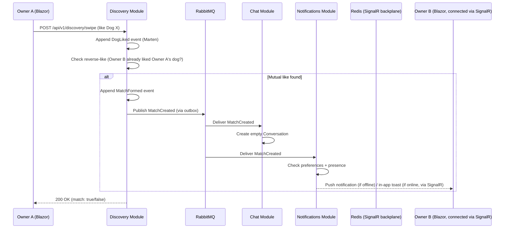
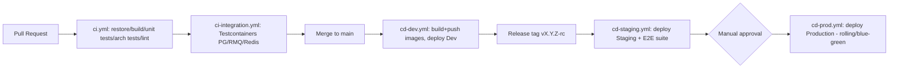

# High-Level Design (HLD) — K9Crush Platform

> **This document's module inventory is stale and not the current source of
> truth** - it predates several rounds of scope changes and only covers 8
> of the modules that actually exist or are planned. `Spec/K9CRUSH.emlang.v3.yaml`
> (its own header, plus the "SCOPE NOTE" block added 2026-07-23) is the
> real source of truth for module boundaries and current scope. As of
> 2026-07-23, the product itself is being descoped away from a "dog dating
> app" toward a shelter/rescue/foster/adoption operations tool plus
> non-profit administration - Discovery/Matching, Chat, Places, Moderation,
> Community, Providers, and Shop are being cut; Profiles is merging into
> ShelterAdoption; a new Donations/Sponsorship module is being added;
> Scheduling is being repurposed for internal shelter ops. None of that is
> reflected in the sections below yet - treat everything under "Module-by-
> Module Design" as historical, not current.

## 1. Module-by-Module Design

### 1.1 Identity Module
**Purpose:** Owner registration/login, token issuance, account verification.

| Aspect | Design |
|---|---|
| Storage | Marten documents: `OwnerAccount`, `EmailVerificationToken` |
| Key slices | `RegisterOwner`, `Login`, `VerifyEmail`, `RefreshToken`, `RequestPasswordReset` |
| Publishes | `OwnerRegistered`, `OwnerVerified` |
| Consumes | — |
| Notes | Passwords hashed (ASP.NET Identity's `PasswordHasher` or Argon2id directly); JWT signing key from secret store |

### 1.2 Profiles Module
**Purpose:** Owner + dog profile data (breed, age, bio, photos reference, location).

| Aspect | Design |
|---|---|
| Storage | Marten documents: `DogProfile`, `OwnerProfile` |
| Key slices | `CreateDogProfile`, `UpdateDogProfile`, `GetDogProfile`, `SetLocation`, `AddPhotoReference` |
| Publishes | `DogProfileCreated`, `DogProfileUpdated` |
| Consumes | `OwnerVerified` (unlocks profile creation), `MediaUploaded` (attach photo URL) |
| Notes | Location stored as `GeoCoordinate` value object; validated via `FluentValidation` (breed from controlled vocabulary, age range, photo count limits) |

### 1.3 Discovery / Matching Module
**Purpose:** Swipe feed generation, like/pass recording, match detection.

| Aspect | Design |
|---|---|
| Storage | Event-sourced: `MatchAggregate` stream (`DogLiked`, `DogPassed`, `MatchFormed`); projection `DiscoveryFeedItem` (read model, rebuilt via Marten async daemon) |
| Key slices | `GetDiscoveryFeed`, `SwipeOnDog` (like/pass), `UndoLastSwipe` (premium feature), `GetMatchList` |
| Publishes | `MatchCreated` |
| Consumes | `DogProfileCreated` (index into discovery pool), `SubscriptionChanged` (unlock undo/boost features) |
| Matching logic | On `DogLiked`, check if the target dog's owner already liked the source dog (reverse-lookup read model) → if so, append `MatchFormed` to both streams, publish `MatchCreated` |
| Geo query | Radius search using PostGIS `ST_DWithin` via Marten raw SQL extension, fallback to bounding-box + Haversine filter in read model for MVP if PostGIS not provisioned |

### 1.4 Chat Module
**Purpose:** Real-time messaging between matched pairs.

| Aspect | Design |
|---|---|
| Storage | Event-sourced: `ConversationAggregate` stream (`MessageSent`, `MessageEdited`, `MessageDeleted`, `MessageRead`); projection `ConversationTranscript` (read model) for fast history/pagination queries |
| Key slices | `SendMessage`, `GetConversationHistory`, `MarkAsRead` |
| Real-time | SignalR `ChatHub`; Redis backplane (`AddStackExchangeRedis`) for multi-replica fan-out |
| Publishes | `MessageSent` |
| Consumes | `MatchCreated` (creates empty `Conversation` shell) |
| Notes | Message send flow: REST/SignalR invoke → validate sender is part of match → append to Marten → publish `MessageSent` (outbox) → SignalR pushes to connected recipient client directly (low latency path), independent of the async event used for notifications |

### 1.5 Notifications Module
**Purpose:** Deliver email/push notifications for key events.

| Aspect | Design |
|---|---|
| Storage | Marten documents: `NotificationPreference`, `NotificationLog` |
| Key slices | `UpdateNotificationPreferences`, `GetNotificationHistory` |
| Consumes | `MatchCreated`, `MessageSent` (debounced — don't push for every message if user is actively in-app), `ContentFlagged` |
| Publishes | — |
| Notes | Consumer checks `NotificationPreference` + user online/presence state (via Redis) before deciding email vs push vs suppress |

### 1.6 Media Module
**Purpose:** Photo/video upload, validation, storage.

| Aspect | Design |
|---|---|
| Storage | **Supabase Storage (S3-compatible), ADR-024** for binaries — superseding the earlier MinIO decision (ADR-009); Marten document `MediaAsset` for metadata. Client uses `AWSSDK.S3` against Supabase Storage's S3-compatible endpoint (`/storage/v1/s3`) — same client code that would have worked against MinIO works unchanged here too, just a different endpoint + credentials |
| Key slices | `RequestUploadUrl` (pre-signed URL pattern), `ConfirmUpload`, `DeleteMedia` |
| Publishes | `MediaUploaded` |
| Consumes | — |
| Notes | Client uploads directly to object storage via signed URL (keeps large payloads off the API host); virus/content scan hook (async) before `MediaUploaded` is published as "approved" |

### 1.7 Subscriptions Module
**Purpose:** Free vs premium tier gating.

| Aspect | Design |
|---|---|
| Storage | Marten document `Subscription` |
| Key slices | `Subscribe` (stubbed payment in MVP), `Cancel`, `GetEntitlements` |
| Publishes | `SubscriptionChanged` |
| Consumes | — |
| Notes | `GetEntitlements` used by Discovery (undo/boost) and Chat (e.g., read receipts) as a feature-flag lookup, cached in Redis |

### 1.8 Moderation Module
**Purpose:** User reporting, content review queue, bans.

| Aspect | Design |
|---|---|
| Storage | Marten document `Report`, `ModerationCase` |
| Key slices | `ReportUserOrContent`, `ReviewCase` (admin), `BanUser` |
| Publishes | `ContentFlagged`, `UserBanned` |
| Consumes | — |
| Notes | `UserBanned` consumed by Identity (revoke tokens) and Discovery (remove from feed pool) |

## 2. API Design Conventions
- **Wolverine.Http** endpoints, one file per slice — a slice is a single static `Handle`/`Endpoint` method with attributes like `[WolverinePost("/api/v1/discovery/swipe")]`, grouped by module route prefix. This keeps the "vertical slice = one file" goal literal: routing, validation, and handling live together without a separate minimal-API lambda wiring step.
- Request → `FluentValidation` validator (Wolverine's middleware pipeline runs validators automatically before the handler and short-circuits with a `400` on failure) → handler → typed response, with Wolverine's compound-return support (`(CreatedResponse, MatchCreated)`) letting a handler both answer the HTTP caller and emit an integration event in one method.
- OpenAPI generated per module and merged at `Api.Host` level; published as a versioned artifact from CI for frontend/Blazor client generation (e.g., via `Microsoft.Extensions.ApiDescription.Client` or Kiota).
- Consistent error shape: RFC 7807 `ProblemDetails` for all failures.
- Versioning: URL segment (`/api/v1/...`) from day one, even with a single version, to avoid a painful first migration.

## 3. Sequence: Swipe → Match → Chat → Notify



## 4. Real-Time Chat Design
- `ChatHub : Hub` with methods `SendMessage`, `JoinConversation`, `MarkRead`.
- Connection groups keyed by `conversationId`; on connect, client joins groups for all its active conversations.
- Redis backplane ensures a message sent to a user connected to replica pod 2 reaches them even if the sender's request landed on replica pod 1.
- Presence tracked in Redis (`SET presence:{userId} online EX 60`, refreshed by heartbeat) — used by Notifications to suppress push when user is actively chatting.
- Message persistence happens **before** SignalR broadcast (write-then-notify) to avoid showing a message that failed to save.

## 5. Data Model Outline (Marten Documents / Events)

```
OwnerAccount (doc)
 ├─ Id, Email, PasswordHash, IsVerified, CreatedAt

DogProfile (doc)
 ├─ Id, OwnerId, Name, Breed, Age, Bio, PhotoIds[], Location(GeoCoordinate)

MatchAggregate (event stream, one per dog-pair candidate)
 ├─ DogLiked { SwiperDogId, TargetDogId, At }
 ├─ DogPassed { SwiperDogId, TargetDogId, At }
 └─ MatchFormed { DogAId, DogBId, At }

DiscoveryFeedItem (projection/read model)
 ├─ DogId, OwnerId, DistanceFromViewerKm, LastActiveAt

Conversation (doc)
 ├─ Id, MatchId, ParticipantOwnerIds[], CreatedAt

ChatMessage (doc, child of Conversation or own doc with ConversationId)
 ├─ Id, ConversationId, SenderOwnerId, Text, SentAt, ReadAt?

NotificationLog (doc)
 ├─ Id, OwnerId, Type, Channel, SentAt, Status

MediaAsset (doc)
 ├─ Id, OwnerId, StorageKey, ContentType, Status(Pending/Approved/Rejected)

Subscription (doc)
 ├─ Id, OwnerId, Tier, RenewsAt, Status

Report / ModerationCase (doc)
 ├─ Id, ReporterOwnerId, TargetType, TargetId, Reason, Status
```

## 6. Frontend (Blazor) High-Level Design
- **Blazor Web App** (.NET 10 unified model): static SSR for public/marketing pages, **Interactive Server** for the swipe/chat experience during MVP (simplifies real-time wiring since it's already server-connected via SignalR-based Blazor circuit), with a path to **WebAssembly** for specific high-interactivity components later (`Auto` render mode lets this evolve without a rewrite).
- State management: scoped services per circuit; `AuthenticationStateProvider` backed by JWT stored in an HttpOnly cookie (avoids WASM localStorage token exposure).
- Chat UI connects to `ChatHub` via a typed `HubConnection` wrapped in a `ChatClientService`.
- Component library: MudBlazor or similar for rapid, consistent UI; own design tokens layered on top for brand identity.
- API access: generated typed HTTP client from the module OpenAPI specs (kept in sync via CI artifact).

## 7. CI/CD Pipeline Design



**Pipeline stage detail:**
1. **Build & unit test**: `dotnet build`, `dotnet test` for unit + architecture tests (NetArchTest asserting no illegal module references).
2. **Integration test**: Testcontainers spin up ephemeral Postgres/RabbitMQ/Redis; run module integration tests against them.
3. **Container build**: multi-stage Dockerfiles per deployable (`Api.Host`, `Blazor.App`), tagged with git SHA + semver, pushed to GHCR.
4. **Image scan**: Trivy scan gate before deploy.
5. **Deploy**: Helm upgrade (or `az containerapp update` if ACA) using environment-specific values files; DB migrations run as a pre-deploy Kubernetes Job (Marten's schema management on startup, or explicit migration job to avoid N replicas racing to migrate).
6. **Smoke test**: post-deploy health check hitting `/healthz/ready` and a synthetic critical-path check (login → feed).
7. **Production gate**: required reviewer approval via GitHub Environments protection rules before `cd-prod.yml` proceeds.

## 8. Non-Functional Requirements Summary

| NFR | Target |
|---|---|
| Availability | 99.5% (MVP), reviewed post-launch |
| API latency (P95) | < 300ms for read endpoints, < 500ms for write endpoints |
| Chat delivery latency (P95) | < 500ms |
| Scalability | Horizontal scale-out of `Api.Host`/`Blazor.App` replicas; stateless design |
| RPO / RTO | RPO < 5 min (Postgres PITR), RTO < 1 hour |
| Data retention | Chat messages retained per privacy policy; media purge on account deletion |
